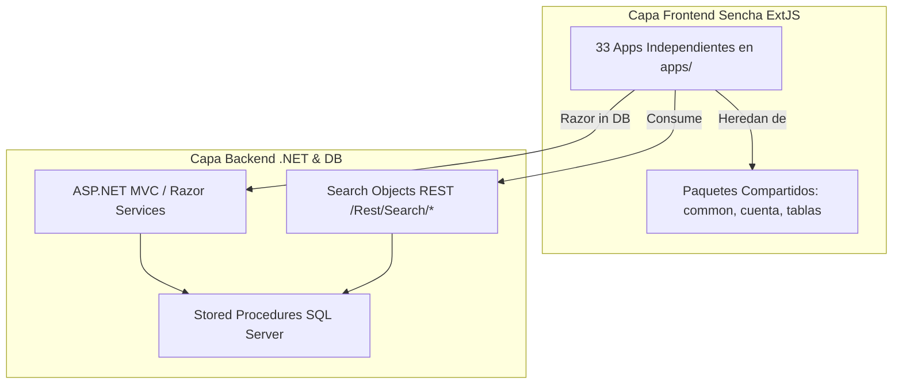
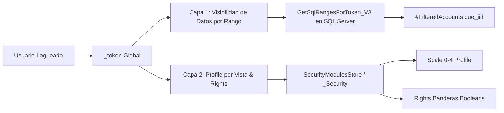
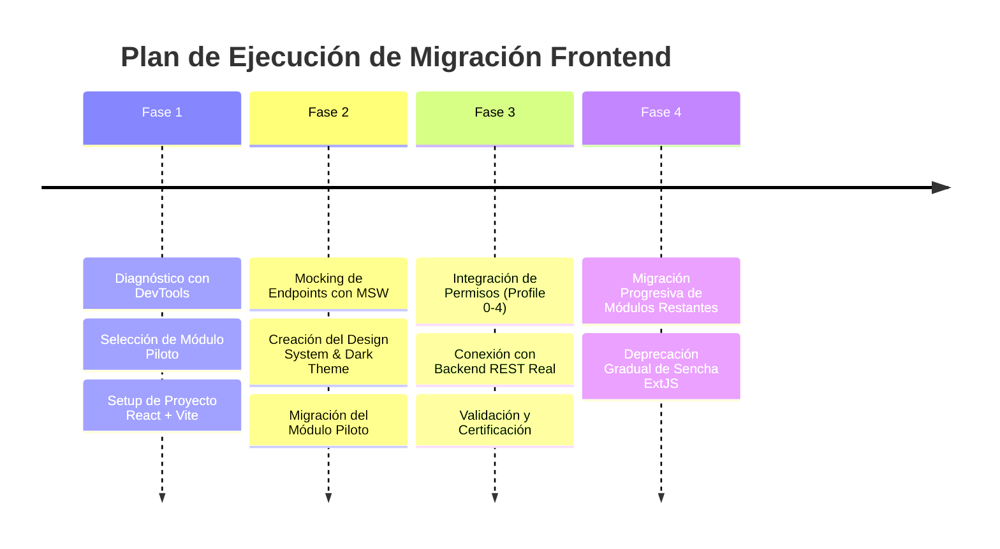

# Softguard CloudSecurity Suite: Guía Definitiva y Roadmap de Migración (Sencha ExtJS a React)

Este documento es el roadmap definitivo y la guía de arquitectura para la migración del sistema **Softguard CloudSecurity (GCS)** desde **Sencha ExtJS (versiones 4 y 7)** hacia un ecosistema moderno en **React + TypeScript**.

Incopora las reglas de negocio, arquitectura de base de datos, flujos de deploy, modelos de permisos y particularidades de los módulos extraídas directamente del conocimiento técnico del sistema (**Obsidian Vault**).

---

## 🏛️ 1. Diagnóstico de Arquitectura Monolítica

El sistema actual es un monolito en producción con más de 10 años de evolución. Su estructura se compone de:



### Características Clave
* **Frontend**: 33 aplicaciones en `apps/` que comparten 3 paquetes locales (`packages/local/common`, `cuenta`, `tablas`). Un cambio en `common` impacta a múltiples aplicaciones simultáneamente. Conviven 3 versiones de ExtJS (4.2, 7.1 y 7.3.1).
* **Backend**: ASP.NET MVC con servicios REST. No hay microservicios reales; existe una sola base SQL Server compartida (`_datos`, `_Sistema`, `_Desktop`, `_tablas`) con queries cruzadas.
* **Lógica de Negocio**: Concentrada en Stored Procedures (`*ByFilter`, `SearchObject`). Hay más de 681 endpoints registrados bajo el patrón `SearchObject`.
* **Paginación y Carga**: Consultas masivas (`pageSize: 2000`, `10000`, `500`) y paginación backend basada en `ROW_NUMBER() OVER(...)`. Tablas históricas particionadas por período (ej: `p_recepcion{YYYYMM}`).

---

## 🚀 2. Flujos de Deploy (Git vs Bundle vs Razor en DB)

> [!WARNING]
> **Importante para el Despliegue**: No todas las aplicaciones se actualizan mediante Git (`gcs/desktop`). Antes de verificar un cambio en producción/testing, se debe identificar el flujo mediante el campo `RazorTemplateId` (`ApplicationHtmlId`).

| Flujo | `RazorTemplateId` | Mecanismo de Despliegue | Ubicación del Código |
| :--- | :--- | :--- | :--- |
| **1. Git / Build Normal** | `10596` | Push a GitLab + Sencha Cmd build + Deploy estándar de archivos compilados. | `gcs/desktop/softguard.workspace/apps/` |
| **2. UIApplication / Bundle** | `247` | Subida manual de Bundle (.zip/blob) desde la propia UI del sistema (`AdministratorSearch` -> `/Rest/Bundle/`). | Base de datos (Tabla `Bundle`). El push a Git no actualiza producción por sí solo. |
| **3. Razor en DB (Dinámico)** | Variado | Edición directa mediante API REST / `tools/gcs/gcs-manager.ps1`. | Tabla `_Desktop..Razor`. Requiere `invalidate-cache` para refrescar el navegador. |

---

## 🔐 3. Sistema de Permisos de 2 Capas

La migración a React debe respetar estrictamente el modelo de seguridad de Softguard:



### Capa 1: Visibilidad por Rangos (Backend SQL Server)
* **SP Central**: `GetSqlRangesForToken_V3` llamado por los SPs `*ByFilter` mediante el parámetro `@token`.
* **Módulos Full Access**: `Administrator` y `WebRemoto`. Dan acceso total (`cue_iid = -1`) sin requerir registros en `UserAccountAccess`.
* **Módulos Range-Driven**: `WebDealer`, `MasterWebDealer`, `TrackGuard`, `SmartPanics`, `SerTec`, `AWCC`, `SgAppAccessControl`, etc. **Requieren** registros explícitos en `_Sistema.dbo.UserAccountAccess`. Si no los tienen, la consulta retorna **0 cuentas**.

### Capa 2: Nivel de Acceso / Profile por Vista (Frontend React)
Obtenido desde `SecurityModulesStore` / endpoint `GET /Rest/Security/Modules`. Genera el objeto `_Security` con `modules[]` y `rights`.

#### Escala de Profile (0 a 4):
* **`0` / `1`**: **Solo Lectura**. Deshabilita botones de guardado, cambio de clave y exportación.
* **`2`**: Acceso intermedio. Muestra paneles extendidos pero deshabilitados.
* **`3`**: **Acceso Completo / Edición**. Habilita llaves, accesos web, dealers y claves.
* **`4`**: **Flujo "Solicitar Cambio"**. Oculta la acción directa de guardado y requiere solicitud previa.

#### Banderas de Rights:
Banderas booleanas específicas e independientes del profile (ej: `rights.cambionumerocuenta`, `rights.claves`, `rights.exportardatosdelacuenta`).

---

## 🧩 4. Especificación Técnica por Módulo (Fase 1 & 2)

### 1. 🛡️ SgAppAccountAdministration (Administración de Cuentas & CRM)
* **KeyReference**: `Administrator`.
* **Vistas Clave**: `AccountAdministratorToolbarView`, `CuentaFormView`, `NotificacionesControlesView`, `MGServiciosContratados`.
* **Requisitos React**:
  * **TabPanel Workspace**: Panel contenedor principal (mimando BorderLayout) donde la lista de Cuentas es persistente y la edición de cuentas abre pestañas dinámicas cerrables.
  * **Árbol Lateral (33 Opciones)**: Menú colapsable (`<<` / `>>`) por cuenta (`Cuenta`, `Situación`, `Usuarios`, `Contactos`, `Zonas`, `Particiones`, `Notificaciones`, `Video Link`, `SmartPanics`, etc.).
  * **Grilla Paginada de Cuentas**: Tabla con acciones, estado, localidad, filtros superiores y barra de búsqueda.
  * **Sub-Tabs de Datos**: `Datos` (Dirección, Clave, Permisos) y `Resolución Extendida` (hereda el profile de `cuentaformview`).

### 2. 📡 WebRemoto (Recepción & Atención de Eventos de Monitoreo)
* **KeyReference**: `WebRemoto`.
* **Vistas Clave**: `AtencionEventoView`, `AtencionEventoGuiadoView`, `ChatDataView`, `SMSMasivoFormView`, `ModoEmergenciaEventosView`.
* **Requisitos React**:
  * **Modos de Atención**: Soporte para atención directa (`EventoMonitoreoController`) y guiada por pasos (`GuidedMonitoringStepsSearch`).
  * **Real-time Event Feed**: Conexión por WebSockets / SSE para cola de eventos entrantes (`eventospendientes`).
  * **Histórico Particionado**: Soporte para consultar `p_recepcion{YYYYMM}` pasando la tabla particionada en los parámetros de la solicitud.

### 3. 📍 Trackguard & SgAppMapGuardWeb (Flota, GPS & Mapas)
* **KeyReference**: `TrackGuard`.
* **Vistas Clave**: `VehicleView`, `GeocercasProgramadasView`, `MapGuardWebController`, `TripViewerController`, `HeatMapView`.
* **Requisitos React**:
  * **Motor de Mapas GPU**: Transición de Google Maps JS API imperativo a `@vis.gl/react-google-maps` o `deck.gl` / MapLibre GL para renderizado fluido de flotas de miles de vehículos.
  * **Playback de Viajes**: Visualizador de rutas y viajes (`M_tgviaje`), geocercas activas y eventos de velocidad/mantenimiento (`TG_Mantenimiento*`).
  * **Polling Eficiente**: Reemplazar `TaskRunner` manual de ExtJS por solicitudes reactivas controladas con TanStack Query y WebSockets.

### 4. 🚪 AccessControl / SgAppAccessControl (Control de Accesos Físicos)
* **KeyReference**: `AccessControl` / `SgAppAccessControl`.
* **Vistas Clave**: `AC_accesoPersonaView`, `AC_accesoProveedorView`, `AC_controlIOFormView`, `p_controlAccesoGridView`.
* **Requisitos React**:
  * Log de marcaciones en tiempo real (`p_controlAcceso`).
  * Gestión de personas, proveedores, vehículos e identificadores/tags (`m_llaves`).
  * Validación de autorizaciones temporales (`caa_fechadesde/hasta`, `caa_diasemana`, `caa_horadesde/hasta`).

### 5. 🖥️ MultiMonitor Web & SmartPanics / SmartTrack
* **KeyReference**: `SmartPanics` / `VigiControl`.
* **Requisitos React**: Dashboard multi-pantalla con alertas sonoras, gestión de eventos de pánico móvil y seguimiento de patrullas.

---

## ⚡ 5. Ecosistema Tecnológico Recomendado para React

| Componente | Tecnología Seleccionada | Razón / Beneficio |
| :--- | :--- | :--- |
| **Core Framework** | React 18+ & TypeScript | Tipado estricto, componentes funcionales y mantenibilidad. |
| **Build Tool** | Vite | Reemplazo de Sencha Cmd. HMR instantáneo y bundling optimizado. |
| **Gestión de Estado UI** | Zustand | Estado global liviano (tabs abiertas, modales, configuración de operador). |
| **Gestión de Estado Servidor** | TanStack Query (`@tanstack/react-query`) | Reemplazo de Stores/Proxies de ExtJS. Caché automático, refetch y paginación. |
| **Estilos & Diseño** | Vanilla CSS / CSS Modules / TailwindCSS | Interfaces oscuras de alta densidad (Dark Mode First), glassmorphism. |
| **Componentes Base** | Radix UI / Shadcn UI | Accesibilidad, modales, toolbars y dropdowns altamente personalizables. |
| **Mock Server (Dev/Testing)** | MSW (Mock Service Worker) | Intercepción de red local sin necesidad de backend en ejecución. |

---

## 🛠️ 6. Estrategia de Mocking e Integración REST (MSW)

Dado que la API de Softguard devuelve la estructura nativa ExtJS Reader (`{ rows: [...], total: N }`), los mocks de desarrollo con MSW deben respetar esta firma exacta:

```typescript
// src/mocks/handlers.ts
import { http, HttpResponse } from 'msw';

export const handlers = [
  http.get('/Rest/Search/CuentaByFilter', ({ request }) => {
    const url = new URL(request.url);
    const page = url.searchParams.get('page') || '1';
    const limit = url.searchParams.get('limit') || '25';

    return HttpResponse.json({
      total: 100,
      rows: [
        {
          cue_iid: 101,
          cue_cnumero: 'BOS-0001',
          cue_cnombre: 'CENTRO COMERCIAL NORTE',
          cue_iStatusRD: 1,
          cue_cdireccion: 'AV. PRINCIPAL 1234',
        },
      ],
    });
  }),
];
```

> [!NOTE]
> **Headers HMAC**: Los headers de firma HMAC (`_t`, `_n`, `_h`) generados en `Application.js` operan en modo `LOG` en el servidor actual, por lo que no impiden el testeo con mocks o llamadas locales durante la fase inicial de desarrollo.

---

## 📋 7. Roadmap de Ejecución Incremental



1. **Fase 1 (Preparación)**:
   - Medir llamadas `/Rest/Search/*` en DevTools Network sobre pantallas lentas para aislar cuellos de botella SQL.
   - Inicializar el workspace React con TypeScript, Vite y TanStack Query.
2. **Fase 2 (Piloto)**:
   - Construir el shell de workspace con pestañas dinámicas y árbol de 33 opciones (`SgAppAccountAdministration`).
   - Implementar el módulo piloto desacoplado del backend mediante MSW.
3. **Fase 3 (Conexión y Seguridad)**:
   - Conectar la aplicación React a los endpoints reales de C# (`/Rest/Search/`).
   - Probar la resolución de permisos por Token (`GetSqlRangesForToken_V3`) y `SecurityModulesStore`.
4. **Fase 4 (Despliegue Incremental)**:
   - Reemplazar progresivamente las apps ExtJS utilizando la estrategia *Strangler Fig* (los dos sistemas conviven vía REST).
