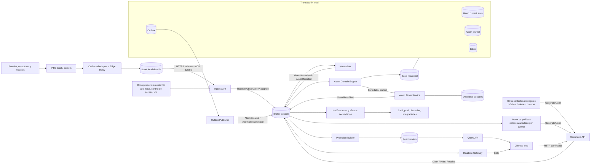
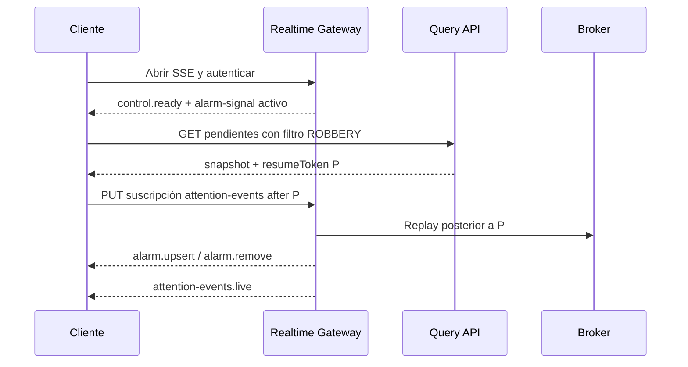

# Arquitectura de eventos en tiempo real

> Estado: análisis inicial para discusión.
>
> Alcance: reemplazar gradualmente el flujo basado en stored procedures y
> polling por una plataforma de eventos portable, ejecutable en Linux, cloud y
> servidores locales.

## 1. Problema

El flujo actual utiliza SQL Server como:

- API de ingreso;
- motor de reglas;
- coordinador de concurrencia;
- cola de trabajo;
- almacenamiento operativo;
- proyección para las pantallas;
- bitácora e histórico;
- mecanismo de integración mediante triggers.

IPRS ejecuta `IPRS_packetProcesor`, la cadena de procedimientos y triggers crea
`p_recepcion` y `EventosPendientes`, y los clientes consultan periódicamente
`/Rest/search/EventosPendientes`. Las acciones de tomar, esperar o procesar un
evento vuelven a ejecutar procedimientos.

Ejemplos concretos del acoplamiento actual:

- [`IPRS_packetProcesor`](../../database/_Desktop/StoredProcedures/IPRS_packetProcesor.sql)
  recibe el DTO ya interpretado por los parsers de IPRS y contiene
  normalización de negocio posterior al parseo, resolución de cuenta, reglas
  condicionadas por parser y coordinación de efectos secundarios.
- [`SGSP_Fill_EventosPendientes`](../../database/_datos/StoredProcedures/SGSP_Fill_EventosPendientes.sql)
  crea una proyección desnormalizada y ejecuta reglas adicionales.
- [`SearchAtencionEventoAtender`](../../database/_Desktop/StoredProcedures/SearchAtencionEventoAtender.sql)
  y
  [`SearchAtencionEventoProcesar`](../../database/_Desktop/StoredProcedures/SearchAtencionEventoProcesar.sql)
  implementan la máquina de estados y la concurrencia entre operadores.
- [`EventosPendientesTrGridController`](../../softguard.workspace/packages/local/common/src/controller/EventosPendientesTrGridController.js)
  utiliza una tarea periódica para volver a cargar el store.
- [`EventosPendientesSearchModel`](../../softguard.workspace/packages/local/common/src/model/EventosPendientesSearchModel.js)
  consulta `/Rest/search/EventosPendientes`.
- [`Web/web.config`](../../Web/web.config) muestra un host ASP.NET Framework 4.0,
  MVC 3 e IIS.

El repositorio contiene aproximadamente 1.249 procedimientos, 128 triggers y
274 scripts SQL con referencias amplias al flujo de eventos. No es razonable
reemplazarlos todos en un único proyecto de reescritura.

### 1.1 El ingreso no es un punto, son sesenta

`IPRS_packetProcesor` es el productor más visible, pero no el único ni el
mayoritario. El análisis estático del repositorio encuentra:

| Medición | Valor |
|---|---:|
| Productores distintos de eventos | ~60 |
| Que ejecutan `AlarmaGenerar` o `SGSP_AlarmaGenerar` | 55 |
| Que omiten `AlarmaGenerar` y escriben vía `SGSP_pRecepcionINS` | 6 |
| Que usan **ambos** caminos según la rama | 6 |
| Sentencias `INSERT INTO p_recepcion` fuera de un procedimiento | 0 |

Los productores se agrupan en seis familias con naturaleza distinta: recepción de
dispositivos, temporizadores y vencimientos, reglas sobre estado acumulado,
efectos de otros dominios, reentrada del propio flujo de atención, y wrappers.

Dos consecuencias que atraviesan todo este documento:

1. **Falta un componente.** Casi veinte productores son deadlines durables ("si
   en N minutos no llegó X, generá Y"). Eso no es ingreso ni normalización: es un
   servicio de timers, tratado en §5.3.
2. **El único embudo real es `SGSP_pRecepcionINS`**, el único objeto del camino
   principal cuya definición no está versionada. Es a la vez el mejor punto de
   instrumentación para la migración y un prerrequisito bloqueante.

El inventario clasificado está en
[`productores-de-eventos.md`](productores-de-eventos.md).

## 2. Objetivos

### Funcionales

- Recibir, normalizar y distribuir alarmas con latencia subsegundo.
- No perder un evento que el sistema haya confirmado como recibido.
- Entregar cambios a los clientes conectados sin polling de la base.
- Mantener toma, espera, procesamiento, supervisión y resolución con control de
  concurrencia.
- Conservar auditoría completa y capacidad de reconstrucción.
- Permitir filtros por tenant, dealer, organización, cuenta, estado, alarma,
  prioridad y permisos.
- Soportar desconexión y reconexión de clientes sin dejar la pantalla en un
  estado inconsistente.

### Arquitectónicos

- Ejecutar en Linux y contenedores OCI.
- Desplegar el mismo producto en cloud, Kubernetes o servidores locales.
- No depender de servicios administrados exclusivos de un proveedor.
- Permitir más de un motor relacional mediante adaptadores y pruebas de
  compatibilidad.
- Mover las reglas de stored procedures y triggers a código versionado,
  observable y testeable.
- Evitar transacciones distribuidas entre broker y base de datos.

## 3. No objetivos iniciales

- No migrar todo SoftGuard ni todos los stored procedures al mismo tiempo.
- No eliminar inmediatamente SQL Server en instalaciones existentes.
- No implementar event sourcing completo como primer paso.
- No exponer el broker directamente a navegadores.
- No prometer compatibilidad automática con “cualquier base”. La portabilidad
  debe definirse mediante una matriz explícita de motores soportados.
- No exigir Kubernetes para una instalación local pequeña.

## 4. Principios

1. El broker reemplaza a la base como mecanismo de transporte, no como
   almacenamiento de consulta.
2. Un solo componente es dueño de las transiciones del agregado `Alarm`.
3. Los demás módulos envían comandos; no actualizan tablas del dominio.
4. La entrega será al menos una vez. Los consumidores deben ser idempotentes.
5. La consistencia entre estado persistido y eventos publicados se resuelve con
   inbox/outbox transaccional.
6. El orden se garantiza por agregado o cuenta, nunca globalmente.
7. Los mensajes son contratos versionados, no filas de una tabla.
8. Los clientes reciben deltas en tiempo real, pero pueden reconstruir su estado
   desde una proyección persistida.
9. La lógica de negocio no depende del broker, ORM o proveedor de base.
10. Cloud native significa automatizable, observable y portable; no significa
    obligatoriamente Kubernetes ni servicios cloud administrados.

## 5. Arquitectura objetivo



### 5.1 IPRS, Edge Relay e Ingress API

IPRS deja de conectarse a SQL. Su responsabilidad termina cuando entrega una
observación inmutable a un spool local y obtiene, directa o indirectamente, una
confirmación durable del Ingress API.

Debe:

- ejecutar los parsers de protocolo existentes y producir campos comunes como
  cuenta observada, evento, zona, usuario y partición;
- conservar los bytes/datos originales y metadatos del receptor;
- asignar un `eventId` estable;
- incluir tenant, receptor, conexión, parser y fechas;
- enviar por un contrato versionado, sin exponer el broker de cloud;
- reintentar sin crear duplicados;
- mantener un spool local en disco cuando no pueda depender de que el dispositivo
  reenvíe el paquete;
- no consultar ni modificar tablas del dominio.

El payload normal de ingreso no es sólo el paquete crudo. Contiene el DTO común
ya producido por IPRS más el original como evidencia. El raw permite auditoría,
diagnóstico y reproceso excepcional; el pipeline no vuelve a ejecutar
normalmente el parser de protocolo.

Se distinguen dos niveles:

```text
Paquete propietario
    → IPRS / parser
    → ReceiverObservation con campos comunes
    → Ingress API
    → Normalizer de negocio
    → AlarmNormalized
```

- **Normalización de protocolo:** ocurre en IPRS y traduce formatos propietarios
  a campos comunes de recepción.
- **Normalización de negocio:** ocurre en el pipeline y resuelve IDs internos,
  configuración, código de alarma, taxonomía y reglas SoftGuard.

El Outbound Adapter puede vivir dentro de IPRS o como un Edge Relay separado en
la misma máquina o red local. El segundo reduce el cambio sobre IPRS y concentra
spool, TLS, rotación de credenciales, actualización y métricas.

El transporte inicial recomendado es HTTPS saliente con `POST` individual o
micro-batches adaptativos. El Ingress API sólo confirma después de publicar en
el broker durable. gRPC streaming, MQTT o NATS Leaf quedan como perfiles
opcionales si las mediciones o una topología edge más compleja los justifican.

Para eventos críticos, el panel sólo debería recibir confirmación después de que
el paquete esté durablemente aceptado por el spool o el broker. Este punto debe
ajustarse a cada protocolo de recepción.

El contrato, ACK, spool, seguridad, alternativas de transporte y migración se
detallan en
[`contrato-ingress-iprs.md`](contrato-ingress-iprs.md).

### 5.2 Normalizer

Reemplaza gradualmente la normalización de negocio que hoy ejecutan
`IPRS_packetProcesor` y sus procedimientos auxiliares en SQL. Consume el
`ReceiverObservation` ya interpretado por IPRS; no reemplaza los parsers ni
decodifica normalmente el paquete propietario.

Etapas propuestas:

1. validar el envelope y el DTO común recibido;
2. resolver la identidad configurada del receptor y la conexión;
3. resolver la cuenta observada a una cuenta interna;
4. mapear el código observado al código y taxonomía SoftGuard;
5. resolver zona, partición y usuario contra configuración de negocio;
6. deduplicar según reglas funcionales;
7. enriquecer y decidir si la observación genera alarma;
8. emitir `AlarmNormalized` o `AlarmRejected`.

Una rama actual condicionada por `AssemblyClassName` no pasa automáticamente a
IPRS: si interpreta sintaxis del protocolo pertenece al parser; si consulta
cuentas, tags o configuración, o produce efectos de negocio, pertenece al
pipeline. Las transformaciones puras deben poder probarse con un DTO parseado de
entrada y una salida esperada sin levantar broker ni base.

### 5.3 Alarm Timer Service

Casi veinte productores actuales no reaccionan a un mensaje entrante: reaccionan
a que **pasó el tiempo** sin que ocurriera algo esperado. Inactividad de cuenta,
testeo periódico no recibido, cierre no reportado, evento sin atención en plazo,
orden de servicio vencida, restauración fallida.

Hoy se resuelven con jobs SQL que barren tablas periódicamente. Un pipeline
orientado a mensajes no tiene dónde alojarlos, porque no hay ningún mensaje que
represente "no pasó nada". Por eso se agrega un componente explícito.

Contrato:

| Comando / hecho | Significado |
|---|---|
| `ScheduleAlarmTimer` | Registrar un deadline al ocurrir un hecho. |
| `CancelAlarmTimer` | Cancelarlo porque llegó el hecho esperado. |
| `AlarmTimerFired` | Venció; genera el comando `GenerateAlarm` correspondiente. |

Requisitos que no son negociables y que hay que resolver en el diseño:

- **Durabilidad.** El deadline sobrevive al reinicio del proceso. Un timer en
  memoria no sirve: el barrido SQL actual tolera una caída porque el próximo
  barrido recupera todo; un `setTimeout` no.
- **Disparo único.** Al vencer se emite un solo comando, con la misma
  idempotencia que el resto del pipeline.
- **Reconciliación al arrancar.** Es la decisión de diseño principal: qué hacer
  con los deadlines que vencieron mientras el servicio estaba caído. ¿Disparar
  todos, emitir uno agregado, descartar los anteriores a un umbral? La respuesta
  es de negocio y difiere por control.
- **Escala.** Millones de deadlines pendientes sin barrer la tabla completa. Una
  cola de prioridad persistida por tiempo de vencimiento, no un `SELECT` sobre
  todas las cuentas.
- **Cancelación masiva.** Un cambio de estado de cuenta debe poder cancelar
  todos sus deadlines de una vez.

**El SLO no es el mismo que el del ingreso.** P95 < 1 s aplica al camino
dispositivo → cliente. Para esta familia la latencia la define la precisión
requerida del control, que puede ser de minutos. Los SLO deben declararse por
familia de productor, no globalmente (ver §12).

Puede implementarse dentro del Alarm Domain Engine o como servicio separado. Si
va separado, el estado del deadline no puede quedar en una base distinta a la del
agregado sin volver a introducir el problema de doble escritura que §5.7 evita.

### 5.4 Alarm Domain Engine

Es el único escritor lógico del estado operativo de una alarma.

Consume:

- `AlarmNormalized`;
- `ClaimAlarm`;
- `PutAlarmOnHold`;
- `ResumeAlarm`;
- `ResolveAlarm`;
- `ReturnAlarm`;
- comandos de supervisión y procesamiento automático.

Produce:

- `AlarmCreated`;
- `AlarmClaimed` o `AlarmClaimRejected`;
- `AlarmPutOnHold`;
- `AlarmResolved`;
- `AlarmRecategorized`;
- `AlarmEnriched`;
- `AlarmArchived`;
- eventos de error o cuarentena.

La máquina de estados que hoy está distribuida entre procedimientos y triggers
se implementa explícitamente en este componente. Cada transición valida:

- estado anterior;
- operador y permisos;
- versión esperada;
- restricciones de cuenta;
- resolución y categorización;
- efectos a emitir.

Estados del modelo actual que la máquina nueva debe cubrir, ya identificados en
[`flujo-principal-eventos.md`](flujo-principal-eventos.md): pendiente, tomado,
espera, tomado desde espera, procesado, autoprocesado, **modo prueba**, **cuenta
inhabilitada**, **llamado telefónico** y el estado temporal de Procesa Todo.

#### El invariante de concurrencia es por cuenta

El diseño anterior asumía el evento individual como unidad de consistencia. El
modelo actual no funciona así: `SearchAtencionEventoAtender` bloquea filas **de
la cuenta** y `p_eventos` representa la ocupación de la cuenta en una terminal.
El invariante real es *un operador ocupa una cuenta*, no *un operador toma un
evento*.

Tres comportamientos actuales lo confirman:

- "Procesa Todo" opera sobre el conjunto de eventos de una cuenta;
- un cambio de estado de la cuenta pasa **en masa** a estado `7` todos sus
  eventos pendientes o en espera;
- la validación de toma rechaza según la ocupación de la cuenta, no del evento.

Ordenar por `tenantId + accountId` (§7.2) hace que esas operaciones se procesen
secuencialmente, pero **no modela el invariante**: dos alarmas distintas de la
misma cuenta tienen versiones optimistas independientes, y `expectedVersion` por
alarma no impide una toma que la regla de cuenta prohíbe.

Hay que elegir explícitamente entre:

| Opción | Ventaja | Costo |
|---|---|---|
| Agregado `AccountAttention` separado, con la alarma como agregado propio | Modela el invariante real; permite comandos de cuenta | Dos agregados coordinados; una toma toca ambos |
| La **cuenta** es el agregado y la alarma una entidad dentro | Invariante trivialmente garantizado; Procesa Todo y cancelación masiva son naturales | Agregado grande; contención en cuentas con muchos eventos |
| Sólo `Alarm` + reserva distribuida por cuenta | Agregado chico | Reintroduce coordinación externa, que es lo que este diseño quiere evitar |

Es una decisión de modelado pendiente, no un detalle de implementación: cambia la
clave de partición, el contrato de comandos y el esquema de persistencia.

### 5.5 Command API

Los navegadores no publican al broker. Envían comandos autenticados a una API:

```text
POST /api/alarms/{alarmId}/claim
POST /api/alarms/{alarmId}/hold
POST /api/alarms/{alarmId}/resolve
POST /api/alarms/{alarmId}/return
```

Cada petición lleva:

- `commandId` o `Idempotency-Key`;
- `expectedVersion`;
- identidad del operador;
- tenant;
- correlation ID.

La API publica el comando de forma durable. Puede esperar brevemente el
resultado y responder sincrónicamente; si el procesamiento demora, devuelve
`202 Accepted` y el resultado llega por el canal en tiempo real.

La toma de un evento debe tener una única respuesta ganadora. Se protege con:

- procesamiento ordenado por cuenta/agregado;
- control de versión optimista;
- restricción transaccional en la persistencia como última defensa.

#### Comandos de nivel cuenta

Un comando por alarma no expresa las operaciones que hoy actúan sobre el conjunto
de eventos de una cuenta:

```text
POST /api/accounts/{accountId}/attention/claim-all     # Procesa Todo
POST /api/accounts/{accountId}/attention/resolve-all
POST /api/accounts/{accountId}/attention/cancel-pending # cambio de estado de cuenta
```

Su semántica depende de la decisión de agregado de §5.4. Con `Alarm` como único
agregado, `claim-all` es un comando compuesto que puede quedar parcialmente
aplicado y necesita definir qué se responde en ese caso.

#### `GenerateAlarm`

Además de los comandos de atención, la API expone la creación de alarmas para
productores que no son ingreso de dispositivo:

```text
POST /api/alarms          # GenerateAlarm
```

Lo usan las familias F2 a F5 del inventario de productores: timers vencidos,
motor de políticas, otros contextos de negocio y la reentrada del propio flujo de
atención.

Exponerlo temprano es lo que permite que el principio de "un único dueño del
agregado" (§4.2) sea cierto durante la migración y no sólo al final. Un
procedimiento SQL que hoy llama a `AlarmaGenerar` puede pasar a publicar este
comando por outbox sin que sus reglas se hayan portado todavía. Ver §13, Fase 3.

Requiere autenticación de servicio, no de operador, y los mismos controles que el
ingreso: idempotencia por `commandId`, validación de esquema y cuota.

### 5.6 Persistencia

Esquema conceptual:

| Estructura | Uso |
|---|---|
| `alarm` | Estado actual, versión, cuenta, prioridad y asignación. |
| `alarm_event` | Journal inmutable de transiciones de dominio. |
| `alarm_observation` | Observaciones y notas. |
| `alarm_attachment` | Metadatos y referencias a multimedia. |
| `consumer_inbox` | IDs ya procesados por consumidor. |
| `outbox_message` | Eventos pendientes de publicación. |
| `alarm_read_model` | Proyección desnormalizada para filtros de atención. |
| `dead_letter` | Mensajes en cuarentena y causa. |

La multimedia no debe viajar completa por el broker. Los mensajes transportan
metadatos, hashes y una referencia a almacenamiento de objetos o filesystem
administrado.

No se recomienda reproducir `p_recepcionYYYYMM` como tablas dinámicas mensuales.
La aplicación usa una tabla lógica estable. Particionado, archivado y retención
son detalles del adaptador de persistencia.

### 5.7 Inbox y outbox

Al consumir un mensaje, el motor ejecuta una única transacción local:

1. inserta el `eventId` en inbox;
2. verifica que no haya sido procesado;
3. actualiza el agregado;
4. agrega el journal;
5. inserta los eventos de salida en outbox;
6. confirma la transacción;
7. recién entonces confirma el mensaje de entrada.

Otro proceso publica el outbox y lo marca después del ACK del broker. Puede
publicar duplicados si falla entre ambas operaciones; por eso todos los
consumidores siguen siendo idempotentes.

Esto evita intentar una transacción distribuida entre broker y base.

### 5.8 Proyecciones

`EventosPendientes` no debería desaparecer conceptualmente: debe convertirse en
un read model reconstruible, actualizado por eventos y sin lógica de dominio.

Puede residir inicialmente en la misma base. Más adelante podría tener
proyecciones diferentes para:

- bandeja de atención;
- mapa;
- monitor de prioridad;
- informes operativos;
- estado de cuenta;
- supervisión.

Las consultas pasan por APIs. Ningún cliente o módulo nuevo accede directamente
a las tablas.

### 5.9 Realtime Gateway

El gateway consume cambios del dominio y los distribuye a conexiones
autenticadas usando WebSocket o Server-Sent Events.

Responsabilidades:

- autenticar y autorizar;
- conocer tenant, organizaciones y dealers permitidos;
- mantener grupos de conexiones;
- aplicar filtros de seguridad;
- controlar backpressure;
- emitir heartbeats;
- cerrar conexiones lentas;
- enviar deltas versionados;
- permitir resincronización.

No se crea un consumidor durable del broker por cada navegador. Cada instancia
del gateway consume el flujo autorizado y distribuye en memoria a sus conexiones.
La fuente de recuperación del navegador es la proyección persistida.

Reconexión:

1. el cliente abre el canal y comienza a acumular deltas;
2. solicita un snapshot paginado por HTTP;
3. aplica el snapshot;
4. aplica sólo deltas con una versión mayor por alarma;
5. ante una discontinuidad, repite el snapshot.

El frontend debe tratar cada mensaje como `upsert` o `remove`, no volver a cargar
todo el store.

### 5.10 Visibilidad, autorización y filtros

La visibilidad tiene tres niveles diferentes:

| Nivel | Pregunta | Responsable |
|---|---|---|
| Aislamiento | ¿A qué tenant pertenece el evento? | Broker, gateway y persistencia. |
| Autorización | ¿Este usuario puede conocer el evento? | Gateway y Query/Command API. |
| Preferencia | ¿Este usuario quiere verlo ahora? | Suscripción del gateway y UI. |

La UI puede aplicar filtros de presentación adicionales, pero nunca debe recibir
un evento que el usuario no esté autorizado a conocer.

#### Los atributos de visibilidad no existen hoy en el evento canónico

`p_recepcion` **no tiene columnas de organización ni de dealer**.
`EventosPendientes` sí (`_idOrganizacion`, `zon_cDealer`, con tres índices que los
usan). La dimensión de autorización se materializa recién en la proyección,
derivada de la cuenta por `SGSP_Fill_EventosPendientes`.

Dos consecuencias para el diseño nuevo:

1. **La resolución de cuenta está en el camino crítico y no puede diferirse.** El
   Normalizer debe resolverla antes de publicar, porque sin cuenta no hay
   organización ni dealer, y sin ellos el gateway no puede decidir a quién
   entregar. No es válido publicar primero y enriquecer después.
2. **`tenantId` es un concepto nuevo.** No existe en el esquema actual;
   `_idOrganizacion` y dealer son alcances *dentro* de una instalación. Si el
   producto sigue siendo una instalación por cliente, tenant es siempre uno y el
   modelo multi-tenant es costo sin beneficio. Si se apunta a una plataforma
   compartida, cambia particionado, autorización, backup y residencia de datos.
   Es la decisión #1 de §17.

#### Contexto de la conexión

Al abrir WebSocket o SSE, el cliente presenta su access token. El gateway:

1. valida firma, issuer, audience, expiración y tenant;
2. obtiene `userId`, roles y permisos;
3. resuelve el alcance efectivo desde autorización:
   - organizaciones;
   - dealers;
   - cuentas o grupos;
   - tipos de evento permitidos;
   - capacidades como `alarm.read`, `alarm.claim` y `alarm.resolve`;
4. conserva ese resultado como `ConnectionSecurityContext`;
5. vuelve a evaluarlo al renovar el token o recibir una invalidación de permisos.

No conviene incluir miles de cuentas en el JWT. El token identifica al usuario y
contiene claims relativamente estables; los alcances grandes o dinámicos se
resuelven desde el servicio de autorización y se mantienen en un cache corto e
invalidable.

El token no se reenvía al broker con cada evento y el broker no toma decisiones
por usuario final. Sólo los servicios confiables se conectan al broker.

#### Suscripción elegida por el usuario

Después de autenticar, el cliente envía un filtro:

```json
{
  "subscriptionId": "main-alarm-grid",
  "families": ["ROBBERY"],
  "states": ["PENDING", "ON_HOLD"],
  "minimumPriority": 0
}
```

El gateway calcula:

```text
effective filter = authorized scope ∩ requested filter
```

Para un operador que sólo quiere atender eventos de robo:

- autorización: organizaciones y dealers a los que pertenece;
- capacidad: `alarm.read` y `alarm.claim`;
- preferencia: familia de alarma `ROBBERY`;
- resultado: sólo recibe robos pertenecientes a su alcance organizacional.

“Robo” debe ser un identificador estable de taxonomía o familia, no una búsqueda
por texto traducido. Los códigos actuales se mapean a esa familia durante la
normalización.

El usuario puede cambiar el filtro sin cerrar la conexión de tiempo real. El
cliente obtiene un nuevo snapshot, reemplaza la suscripción mediante HTTP y
continúa con deltas desde el cursor nuevo.

#### Routing y fanout

Los mensajes incluyen atributos suficientes para evaluar visibilidad sin hacer
una consulta por cada conexión:

- `tenantId`;
- `organizationId`;
- `dealerId`;
- `accountId`;
- `alarmFamilyId`;
- `alarmCode`;
- `state`;
- `priority`;
- `aggregateVersion`.

El broker puede enrutar de forma gruesa por tenant, organización o familia para
reducir tráfico entre servicios. Los filtros particulares de cada usuario se
aplican en el gateway.

No se crea un topic, stream o consumidor durable por usuario. Cada instancia del
gateway consume los eventos de los tenants que atiende y mantiene índices en
memoria como:

```text
tenant → organization → alarm family → connections
```

#### Snapshot y deltas

La Query API aplica exactamente la misma autorización y filtro que el gateway.
El filtro puede representarse mediante un `subscriptionId` firmado o mediante
un contrato compartido para evitar diferencias.

El gateway emite:

- `alarm.upsert` cuando una alarma entra o permanece dentro del filtro;
- `alarm.remove` cuando se resuelve, cambia de categoría o deja de coincidir;
- `subscription.resync-required` si detecta una discontinuidad.

Si una alarma se recategoriza de `ROBBERY` a otra familia, el usuario que filtra
robos debe recibir `alarm.remove`, aunque ya no coincida con su filtro nuevo. El
gateway conserva el conjunto de alarmas entregadas por conexión o suscripción
para poder calcular esa salida.

#### Autorización de comandos

Haber recibido o poder leer una alarma no autoriza automáticamente a atenderla.
Cada comando vuelve a validar:

- identidad actual;
- permiso `alarm.claim` o `alarm.resolve`;
- alcance sobre la cuenta;
- estado y versión de la alarma;
- restricciones de asignación y supervisión.

El Alarm Domain Engine es la última autoridad. Un cliente modificado no puede
tomar un evento enviando directamente un ID que no apareció en su pantalla.

### 5.11 Varios streams por cliente

Un cliente puede consumir varios canales lógicos sobre una única conexión de
tiempo real. No hace falta abrir una conexión ni crear un consumidor del broker
por cada función de la pantalla. La sección siguiente selecciona SSE como
transporte inicial.

| Canal lógico | Propósito | Filtro del usuario | Recuperación |
|---|---|---|---|
| `control` | ACK, errores, renovación e invalidación | Ninguno | Estado de la conexión |
| `alarm-signal` | Disparar el aviso sonoro con payload mínimo | Ninguno | Sólo eventos nuevos |
| `attention-events` | Mantener la grilla de atención | Familia, estado y otros permitidos | Snapshot más replay |

`alarm-signal` es una suscripción automática. Que no tenga filtros de preferencia
no significa que evite la seguridad: siempre conserva el aislamiento de tenant
y el alcance autorizado. Si la grilla está filtrada por `ROBBERY`, una alarma
de otra familia puede producir sonido igualmente, pero nunca puede hacerlo una
alarma de otro tenant o fuera del alcance del operador.

Un mensaje del canal sonoro sólo necesita datos como:

```json
{
  "channel": "alarm-signal",
  "type": "alarm.new-signal",
  "sequence": "984215",
  "data": {
    "signalId": "01J...",
    "alarmId": "99127",
    "occurredAt": "2026-07-30T18:03:12.345Z",
    "priority": 1,
    "soundProfile": "critical"
  }
}
```

No debe transportar el DTO completo, datos del abonado ni textos que la alarma
sonora no utiliza. `signalId` permite que el cliente descarte una entrega
duplicada.

El canal `attention-events` sí acepta suscripciones configurables. El contrato
conceptual es:

```json
{
  "action": "subscribe",
  "channel": "attention-events",
  "subscriptionId": "main-alarm-grid",
  "resumeAfter": "opaque-resume-token",
  "filter": {
    "families": ["ROBBERY"],
    "states": ["PENDING", "ON_HOLD"]
  }
}
```

Cada canal tiene su propia política de recuperación. **La secuencia, en cambio,
debe ser única por conexión** — ver la restricción de `Last-Event-ID` en §5.12.
El gateway prioriza en su cola de salida los mensajes `control` y `alarm-signal`
sobre los DTO completos de la grilla. Las colas son acotadas y una saturación del canal de atención obliga a
resincronizarlo, no a acumular memoria sin límite. Si las pruebas demuestran que
TCP o el volumen masivo impiden cumplir la latencia de la señal sonora, se puede
separar físicamente ese canal sin cambiar su contrato lógico.

#### Snapshot inicial sin perder eventos

Sí debe existir un `GET` que recupere lo que ya estaba pendiente:

```http
GET /api/v1/attention-events?families=ROBBERY&states=PENDING,ON_HOLD
```

Una respuesta conceptual es:

```json
{
  "items": [],
  "snapshotId": "01J...",
  "nextPageToken": null,
  "resumeToken": "opaque-projection-position"
}
```

`resumeToken` no es una fecha. Representa de forma opaca la posición durable
hasta la cual la proyección estaba aplicada cuando se tomó el snapshot. Si
existen varias particiones puede contener sus posiciones, firmado o cifrado por
el servidor. La lectura de los elementos y del checkpoint debe ser consistente;
si hay paginación, todas las páginas pertenecen al mismo `snapshotId`.

Con SSE, la suscripción se registra por HTTP sobre la sesión realtime; SSE se
usa sólo para recibir. El inicio recomendado es:



Así se evita el hueco entre “terminó el GET” y “empecé a escuchar”. Todo evento
posterior a `P` se recupera desde el log durable aunque haya ocurrido durante el
GET o antes de completar la suscripción.

El cliente:

1. reemplaza la grilla con el snapshot;
2. aplica los deltas posteriores a `P`;
3. trata `alarm.upsert` como idempotente y conserva la mayor
   `aggregateVersion`;
4. aplica `alarm.remove` como un tombstone versionado;
5. guarda el último token confirmado para una reconexión corta.

Si el token ya quedó fuera de la retención, cambió la autorización o se detecta
una discontinuidad, el gateway envía `subscription.resync-required` y el
cliente repite el `GET`. Cambiar el filtro de la grilla también inicia un nuevo
snapshot y una nueva suscripción de forma atómica.

El canal sonoro normalmente es `live-only`: no reproduce en la reconexión todos
los sonidos que ocurrieron mientras la aplicación estaba cerrada. Los eventos
pendientes anteriores aparecen mediante el snapshot. Si el negocio necesita
avisar que hubo actividad durante la desconexión, conviene emitir un único
resumen al reconectar, no reproducir toda la historia.

### 5.12 Transporte propuesto: SSE para salida y HTTP para entrada

Para el flujo conocido se recomienda **Server-Sent Events (SSE) para
servidor → cliente** y **HTTP para cliente → servidor**. WebSocket queda como
alternativa comprobable, no como requisito inicial.

La interfaz queda separada:

| Operación | Transporte |
|---|---|
| Consultar el snapshot pendiente | `GET /api/v1/attention-events` |
| Recibir señales y deltas | `GET /api/v1/realtime/stream` con SSE |
| Atender, pausar o resolver | `POST` sobre el recurso o comando |
| Cambiar preferencias | `PUT`/`POST` de suscripción y nuevo snapshot |

SSE coincide con la asimetría del caso de uso: después de conectarse, el
navegador principalmente recibe. El protocolo utiliza una respuesta HTTP
`text/event-stream`, distingue tipos lógicos mediante `event:`, permite asignar
un `id:` y el navegador intenta reconectar. En una reconexión, `Last-Event-ID`
permite continuar desde el último evento recibido.

Una única conexión SSE puede multiplexar los canales lógicos:

```text
id: 984215
event: alarm-signal
data: {"signalId":"01J...","priority":1,"soundProfile":"critical"}

id: 984216
event: alarm-upsert
data: {"alarmId":"99127","aggregateVersion":4}
```

El cursor inicial proviene del `resumeToken` del snapshot. Después, cada `id:`
actualiza la posición de recuperación. Al reanudar, el gateway puede reproducir
los deltas de `attention-events` pero suprime señales sonoras históricas porque
`alarm-signal` es `live-only`.

#### Restricción: `Last-Event-ID` es único por conexión

`EventSource` mantiene **un solo** `Last-Event-ID` por conexión, actualizado por
el último `id:` recibido sin importar su `event:`. Multiplexar canales lógicos
sobre una conexión SSE y darle a cada uno su propia secuencia produce un cursor
ambiguo: al reconectar, el navegador envía un id que puede pertenecer a cualquier
canal, y el gateway no puede derivar de él la posición de los demás.

El ejemplo de arriba lo muestra: `984215` y `984216` sólo funcionan porque son
una secuencia compartida, no dos.

Opciones válidas, hay que elegir una:

1. **Secuencia única por conexión** — un contador monotónico que abarca todos los
   canales. Simple y compatible con la reconexión nativa. El costo es que el
   cursor no distingue progreso por canal, aceptable porque `alarm-signal` es
   `live-only` y no se reproduce.
2. **Cursor compuesto opaco** — el `id:` codifica la posición de todos los
   canales, firmado o cifrado por el servidor. Conserva políticas por canal a
   costa de un token más grande en cada evento.
3. **Abandonar la reanudación nativa** — usar streaming con `fetch` y un cursor
   propio. Es la opción 2 de autenticación del stream, y sólo se justifica si esa
   decisión ya se tomó por otro motivo.

La opción 1 es la recomendada para el primer corte. Cualquiera de las tres exige
que el gateway rechace un `Last-Event-ID` fuera de retención con
`subscription.resync-required` en vez de reanudar desde una posición dudosa.

Los comandos permanecen en HTTP:

```http
POST /api/v1/alarms/99127/claim
Idempotency-Key: 01J...
If-Match: "version-4"
```

Esto conserva semántica HTTP, autorización por comando, respuesta inmediata,
idempotencia, control de concurrencia y observabilidad. La confirmación
definitiva también llega por SSE para que todas las pantallas converjan.

#### Autenticación del stream

La API nativa `EventSource` acepta URL y modo de credenciales, pero no permite
configurar un header `Authorization` arbitrario. Por eso se debe elegir uno de
estos modelos:

1. aplicación same-site con cookie de sesión `Secure`, `HttpOnly` y
   `SameSite`, junto con protección CSRF en los comandos; o
2. streaming con `fetch`, que permite enviar el Bearer header pero requiere
   implementar parsing, reconexión y `Last-Event-ID`; o
3. un `POST /api/v1/realtime/sessions` autenticado con Bearer que entrega una
   sesión opaca, breve y revocable para abrir y reanudar únicamente ese stream.

Nunca se coloca un access token reutilizable en la query string. Si se usa una
sesión opaca en la URL, los proxies deben omitir o redactar la query en sus logs.
La sesión no autoriza comandos y debe quedar ligada al usuario, tenant y
dispositivo. La elección entre cookie, `fetch` y sesión opaca debe entrar en el
POC.

#### Requisitos operativos

- TLS obligatorio.
- Heartbeat SSE periódico mediante comentarios para detectar conexiones
  muertas y evitar timeouts ociosos.
- Desactivar buffering del reverse proxy para `text/event-stream` y enviar cada
  evento inmediatamente.
- Configurar timeouts de balanceador mayores que el intervalo de heartbeat.
- Mantener colas de salida acotadas; un cliente lento recibe
  `resync-required`.
- Permitir que cualquier gateway reconstruya desde el cursor para no depender
  de sticky sessions.
- Probar HTTP/2 en la topología on-premise real; permite multiplexar los
  requests HTTP concurrentes sobre una conexión.

#### Cuándo elegir WebSocket

WebSocket pasa a ser preferible si aparece alguno de estos requisitos:

- tráfico cliente → servidor continuo y de alta frecuencia;
- cambios de suscripción tan frecuentes que HTTP resulta inadecuado;
- payload binario relevante;
- protocolo interactivo bidireccional que no encaja como comando HTTP;
- compatibilidad obligatoria con un cliente sin `EventSource`;
- una prueba con proxies reales muestra que SSE no cumple la latencia.

El repositorio ya contiene un wrapper WebSocket en
[`WebSocketJs.js`](../../softguard.workspace/apps/IPRSManager/app/WebSocketJs.js),
lo que reduce el costo de una prueba con ese transporte. Sin embargo, también
incluye ExtJS 4.2 y referencias a navegadores antiguos. La nueva plataforma debe
declarar su matriz de navegadores: `EventSource` funciona en los motores
actuales, pero no en Internet Explorer. Mantener IE cambiaría esta decisión o
exigiría un fallback.

## 6. Contratos de mensajes

Se propone CloudEvents 1.0 como envoltorio y JSON como formato inicial.

Campos mínimos:

```json
{
  "specversion": "1.0",
  "id": "01J...",
  "source": "/softguard/iprs/receiver-12",
  "type": "com.softguard.alarm.normalized.v1",
  "subject": "tenant/7/account/3182/alarm/99127",
  "time": "2026-07-30T18:03:12.345Z",
  "datacontenttype": "application/json",
  "dataschema": "urn:softguard:schema:alarm-normalized:1",
  "tenantid": "7",
  "correlationid": "01J...",
  "causationid": "01J...",
  "partitionkey": "7:3182",
  "data": {}
}
```

Reglas:

- `source + id` identifica duplicados.
- Los nombres de tipo son hechos pasados; los comandos usan contratos
  separados.
- Cambios incompatibles crean una versión nueva.
- Los timestamps son UTC/RFC 3339.
- Los mensajes no contienen secretos ni credenciales.
- `aggregateVersion` permite descartar deltas viejos.
- Los contratos se describen con AsyncAPI y JSON Schema.

## 7. Garantías

### 7.1 Entrega

La garantía práctica debe ser:

> cero pérdida de mensajes confirmados, entrega al menos una vez y efecto
> idempotente exactamente una vez sobre el estado.

No se debe basar el diseño en una afirmación genérica de “exactly once” del
broker. Esa garantía no cubre automáticamente broker, base, efectos externos y
navegador como una única transacción.

### 7.2 Orden

No se necesita orden global. Sí se necesita orden para:

- transiciones de la misma alarma;
- restricciones de atención de una misma cuenta;
- comandos de asignación relacionados.

La clave recomendada es `tenantId + accountId`; cada mensaje también mantiene
`alarmId` y `aggregateVersion`.

Si se usa NATS con consumidores paralelos, debe aplicarse particionado
determinístico. Las queue groups por sí solas no garantizan que dos mensajes
consecutivos lleguen al mismo worker.

### 7.3 Fallos

- Un mensaje no confirmado se reentrega.
- Un mensaje inválido va a cuarentena con el payload original y el error.
- Alcanzar el máximo de reintentos genera una alarma operativa.
- Si la base está caída, el consumidor deja los mensajes pendientes en el
  broker.
- Si el gateway está caído, la alarma sigue procesándose y el cliente recupera
  un snapshot al reconectar.
- Si el broker está inaccesible, IPRS conserva el paquete en su spool.

## 8. Opciones de broker

### Opción A: NATS JetStream

Ventajas:

- servidor y persistencia integrados;
- instalación liviana para clientes on-premise;
- subjects jerárquicos y filtrado del lado servidor;
- request/reply, pub/sub y streams en la misma plataforma;
- consumidores durables, ACK, redelivery, replay y deduplicación;
- clúster Raft de 3 o 5 nodos;
- despliegue oficial mediante contenedor o Helm;
- buen encaje futuro con edge/leaf nodes.

Atenciones:

- Core NATS es `at-most-once`; los eventos y comandos críticos deben usar
  JetStream.
- La distribución paralela común no conserva afinidad por clave. Hay que
  configurar particiones determinísticas o procesar secuencialmente.
- El ecosistema de streaming, CDC y schema registry es menor que el de Kafka.
- La cuarentena requiere una política de aplicación explícita.

Evaluación: **candidato preferido provisional** cuando pesan más la simplicidad
operativa, las instalaciones locales y el routing fino que un ecosistema masivo
de streaming.

### Opción B: Apache Kafka

Ventajas:

- log distribuido y replay muy maduros;
- orden garantizado dentro de una partición;
- particionado natural por cuenta;
- ecosistema amplio de conectores, CDC, procesamiento y registros de esquema;
- múltiples implementaciones y servicios compatibles con su API.

Atenciones:

- mayor consumo y complejidad operativa en instalaciones pequeñas;
- requiere diseño cuidadoso de topics, particiones, grupos y retención;
- el routing fino se resuelve principalmente con topics, keys o consumidores,
  no con subjects dinámicos;
- un clúster productivo sigue siendo más exigente aunque KRaft haya eliminado
  ZooKeeper.

Evaluación: **candidato preferido** si el volumen, la retención prolongada, el
replay masivo, el CDC y el orden por clave justifican su costo operativo.

### Opción C: RabbitMQ

Ventajas:

- routing flexible y modelo de colas maduro;
- quorum queues replicadas para comandos;
- streams y superstreams para replay;
- AMQP y ecosistema ampliamente conocidos;
- despliegue on-premise probado.

Atenciones:

- para este diseño habría que combinar semántica de queues y streams;
- el modelo de log/replay no es tan central como en Kafka;
- particionado, orden y retención requieren elegir correctamente entre quorum
  queues, streams y superstreams.

Evaluación: alternativa sólida si la organización ya opera RabbitMQ o si
predominan las colas de trabajo. Para una plataforma nueva de alarmas, NATS o
Kafka ofrecen un modelo más directo.

### Comparación resumida

| Criterio | NATS JetStream | Apache Kafka | RabbitMQ |
|---|---|---|---|
| Instalación local pequeña | Muy favorable | Menos favorable | Favorable |
| Orden estricto por clave | Requiere sharding | Nativo por partición | Depende de topología |
| Routing por tenant/tipo | Muy favorable | Moderado | Muy favorable |
| Replay y retención | Favorable | Muy favorable | Favorable con streams |
| Ecosistema CDC/streaming | Moderado | Muy favorable | Favorable |
| Complejidad operativa | Baja/moderada | Alta | Moderada |
| Cloud y on-premise | Sí | Sí | Sí |
| HA mínima recomendada | 3 nodos | 3 o más roles/nodos | 3 nodos |

No conviene ocultar todas las diferencias detrás de una abstracción enorme.
Debe existir un port pequeño para publicar/consumir mensajes, pero la topología
y las garantías del broker elegido forman parte explícita de la arquitectura.

## 9. Runtime y push web

El runtime no es una decisión inherente a la arquitectura. Los contratos,
garantías, particionado, inbox/outbox y persistencia deben funcionar igual con
Node.js, .NET, Java o Go.

La propuesta inicial mencionaba .NET porque el backend existente pertenece al
ecosistema C#/.NET. Sin embargo, gran parte de la lógica a migrar está en SQL y
no puede reutilizarse directamente como código C#. Esa ventaja es menor de lo
que parece.

### Opción A: Node.js con TypeScript

Ventajas:

- stack conocido por desarrolladores web y cercano al frontend actual;
- modelo asíncrono apropiado para sockets, broker, APIs, base y WebSockets;
- un mismo lenguaje para contratos, gateway, comandos y servicios;
- cliente oficial de NATS con soporte JetStream;
- buen encaje con contenedores Linux;
- iteración rápida para portar reglas y construir herramientas de replay.

Atenciones:

- el event loop no debe ejecutar trabajo pesado o bloqueante;
- criptografía, compresión o procesamiento multimedia intensivos deben
  ir a worker threads, procesos separados o implementaciones nativas;
- TypeScript verifica tipos antes de ejecutar, pero los tipos se borran al
  compilar: cada mensaje recibido necesita validación de runtime contra su
  schema;
- hay que controlar estrictamente dependencias, lockfiles, actualizaciones,
  SBOM y vulnerabilidades del ecosistema npm;
- múltiples réplicas siguen necesitando particionado y control de concurrencia;
  el event loop de un proceso no resuelve concurrencia distribuida.

Configuración propuesta si se elige:

- Node.js 24 LTS;
- TypeScript con `strict` y sin `any` en contratos;
- JSON Schema como fuente o validación obligatoria de mensajes;
- framework HTTP modular, sin acoplar el dominio al framework;
- workers separados para tareas CPU-bound;
- procesos sin estado y escalables horizontalmente;
- NATS JetStream o Kafka detrás de un port pequeño de mensajería.

Node.js puede implementar todo el corte vertical:

- Edge Relay e Ingress API;
- Normalizer;
- Alarm Domain Engine;
- Outbox Publisher;
- Projection Builder;
- Query/Command API;
- Realtime Gateway.

No es necesario reservarlo únicamente para el gateway.

Esta elección de runtime corresponde al pipeline nuevo. No implica reescribir
en Node.js los parsers de protocolo que ya pertenecen a IPRS.

### Opción B: .NET moderno

Ventajas:

- continuidad con conocimiento y componentes C# que puedan existir fuera de
  este repositorio;
- tipado estático y buen soporte para servicios de larga duración;
- ASP.NET Core integra APIs, WebSockets, SSE y SignalR;
- herramientas maduras para concurrencia, background services y acceso a datos;
- runtime multiplataforma y contenedores Linux.

Atenciones:

- no reutiliza automáticamente las reglas escritas en T-SQL;
- mantiene dos lenguajes principales si la mayoría del equipo trabaja en
  JavaScript;
- SignalR puede acoplar el protocolo del cliente si se deja filtrar hacia los
  contratos de dominio.

### Otras opciones

| Runtime | Encaje principal | Costo |
|---|---|---|
| Java/Kotlin | Excelente ecosistema Kafka y operación empresarial. | Mayor peso y curva si el equipo no usa JVM. |
| Go | Edge Relay, Ingress y binarios pequeños de alto rendimiento. | Menor productividad si hay muchas reglas de dominio cambiantes y poco conocimiento interno. |

### Recomendación revisada

Node.js/TypeScript es un candidato de primera clase y posiblemente la mejor
opción si el equipo tiene más experiencia en JavaScript que en C#.

No conviene comenzar con varios runtimes. La POC debe implementar el corte
vertical en Node.js/TypeScript y medir:

- latencia P95/P99;
- pausas de event loop;
- memoria;
- rendimiento de la normalización de negocio;
- reconexión al broker;
- recuperación de backlog;
- comportamiento bajo mensajes grandes o maliciosos.

Sólo si esas pruebas muestran un límite concreto debería extraerse un worker
CPU-bound a Go/.NET. La arquitectura no debe volverse políglota por
anticipación.

Para el push web:

- SSE como transporte principal servidor → cliente;
- comandos mediante HTTP;
- WebSocket sólo si el POC demuestra una necesidad bidireccional concreta;
- protocolo propio basado en los contratos versionados;
- SignalR opcional si finalmente se elige .NET.

## 10. Portabilidad de base de datos

Mover los stored procedures a código es necesario, pero un ORM no vuelve
idénticos a los motores.

Política propuesta:

1. Dominio puro, sin tipos SQL ni EF.
2. Interfaces de repositorio y unit of work.
3. EF Core para operaciones comunes.
4. SQL especializado encapsulado por proveedor.
5. Migraciones separadas por motor.
6. Suite de integración ejecutada contra cada base soportada.
7. PostgreSQL y SQL Server como primera matriz.
8. MySQL/MariaDB sólo cuando pase la misma suite.

Características mínimas exigidas al motor:

- transacciones ACID;
- índices y restricciones únicas;
- control de concurrencia optimista;
- timestamps UTC;
- paginación estable;
- aislamiento suficiente para la toma concurrente;
- backups y recuperación punto en el tiempo para producción.

Se deben evitar en el dominio:

- nombres dinámicos de tablas;
- triggers funcionales;
- stored procedures de negocio;
- hints como `NOLOCK` o `UPDLOCK`;
- tipos propietarios sin adaptador;
- autenticación integrada de Windows;
- dependencia de collation para reglas funcionales.

## 11. Despliegue

### Perfil desarrollo / laboratorio

- contenedores con Compose;
- un broker;
- una base;
- servicios en una sola máquina.

No es un perfil de alta disponibilidad.

### Perfil local estándar

- 3 nodos de broker con discos independientes;
- base con réplica/HA según el motor;
- 2 instancias de API/gateway detrás de un proxy;
- almacenamiento durable;
- backups externos;
- contenedores administrados por Kubernetes liviano, Kubernetes estándar,
  Podman/systemd u otro orquestador soportado.

### Perfil cloud

- mismos contenedores e imágenes;
- Kubernetes y Helm;
- distribución entre zonas;
- broker y base autogestionados o servicios compatibles opcionales;
- ninguna dependencia funcional de la API propietaria del proveedor.

Kubernetes debe ser una opción de operación, no una dependencia dentro del
código.

## 12. Observabilidad

Instrumentación OpenTelemetry para trazas, métricas y logs.

Cada alarma conserva `traceId`, `correlationId` y `eventId` desde el ingreso
hasta el navegador.

Métricas mínimas:

- paquetes recibidos, confirmados, duplicados y rechazados;
- edad del elemento más antiguo del spool;
- latencia ingreso → normalización;
- latencia ingreso → persistencia;
- latencia ingreso → entrega al gateway;
- lag por consumidor;
- redeliveries y cuarentena;
- tamaño y edad del outbox;
- comandos aceptados, rechazados y en conflicto;
- conexiones activas y clientes lentos;
- tiempo de snapshot y resincronizaciones;
- errores por protocolo y regla;
- failover y disponibilidad de broker/base.

SLO inicial para validar con negocio:

- cero pérdida de paquetes confirmados;
- P95 menor a 1 segundo desde ingreso durable hasta cliente conectado;
- P99 menor a 2 segundos;
- toma concurrente con un único ganador;
- recuperación automática después de reiniciar cualquier proceso;
- capacidad de absorber al menos 10 veces el pico actual durante una
  indisponibilidad temporal de la base.

**Los SLO de latencia aplican al camino de recepción de dispositivos, no a todos
los productores.** Un evento de inactividad o de testeo no recibido tiene la
precisión del control que lo genera, medida en minutos. Corresponde declarar:

| Familia de productor | Métrica de latencia |
|---|---|
| Recepción de dispositivos | Ingreso durable → cliente conectado. P95 < 1 s. |
| Temporizadores y vencimientos | Vencimiento real → alarma generada. Precisión a acordar por control. |
| Reglas sobre estado acumulado | Hecho que dispara la regla → alarma generada. |
| Otros contextos y reentrada | Comando aceptado → alarma generada. |

Para la familia de temporizadores conviene además medir el **atraso del
deadline**: diferencia entre el momento en que debía vencer y el momento en que
efectivamente se disparó. Es la métrica que revela una caída del Timer Service,
que de otro modo se manifiesta como silencio.

## 13. Estrategia de migración

### Fase 0: caracterización

- **obtener la definición desplegada de `SGSP_pRecepcionINS`** — bloqueante;
- medir volumen promedio, pico y ráfagas;
- medir tamaño de payload y multimedia;
- establecer SLO/RPO/RTO por familia de productor;
- capturar corpus representativo de `p_RXLog`;
- asociar cada paquete con `p_recepcion`, `EventosPendientes` y timeline;
- validar el inventario de productores contra una base desplegada;
- medir el volumen real por familia;
- inventariar reglas y efectos secundarios por procedimiento;
- completar la máquina de estados actual.

Entregable: banco de pruebas de compatibilidad del comportamiento legado.

**El corpus de `p_RXLog` cubre una sola familia.** Sólo los eventos que vienen de
un paquete dejan registro ahí. Los generados por timers, reglas acumuladas,
triggers de otros dominios o reentrada del flujo de atención no aparecen. Un
golden master construido únicamente con ese corpus valida la recepción de
dispositivos y nada más.

La captura de las otras cinco familias se hace en `SGSP_pRecepcionINS`, que es el
único punto por el que pasan todas. De ahí que su definición sea prerrequisito y
no una tarea de documentación.

### Fase 1: tiempo real sin cambiar todavía el dominio

Objetivo: eliminar el polling visible antes de portar toda la lógica.

Alternativas:

1. outbox transaccional insertado junto al cambio actual;
2. CDC sobre `p_recepcion`, `EventosPendientes` y timeline como puente;
3. adaptador que convierte cambios de filas a eventos de dominio legados.

El gateway consume esos eventos y actualiza el store ExtJS mediante deltas. Las
acciones siguen usando los endpoints y stored procedures existentes.

CDC es una herramienta de transición, no el contrato final: una fila modificada
no expresa por sí sola la intención de negocio.

### Fase 2: ingreso durable y ejecución paralela

- IPRS publica `ReceiverObservation`: el DTO interpretado por sus parsers más el
  paquete original;
- el flujo SQL continúa siendo productivo;
- el nuevo Normalizer procesa en modo shadow;
- se comparan resultados campo por campo;
- las divergencias se clasifican y corrigen;
- no se generan todavía efectos externos desde el flujo nuevo.

### Fase 3: alta de un subconjunto

- elegir un protocolo/dealer controlado;
- activar el nuevo Normalizer y Alarm Engine;
- persistir mediante un adaptador compatible con las tablas legadas;
- emitir eventos nuevos;
- mantener rollback rápido al procedimiento actual;
- ampliar progresivamente por protocolo.

#### El corte por protocolo no aísla el agregado

Una cuenta del protocolo migrado puede recibir simultáneamente eventos del
pipeline nuevo y eventos generados en SQL por un timer de inactividad, una regla
de exceso o un trigger de asignación de móvil. Como el orden se garantiza por
`tenantId + accountId`, quedan dos escritores sobre la misma clave de partición y
ni el orden ni el principio de único dueño del agregado (§4.2) se sostienen.

Opciones, ninguna gratuita:

| Opción | Qué implica |
|---|---|
| **Cortar por cuenta, no por protocolo** | Migrar todas las fuentes de una cuenta a la vez. Requiere poder dirigir los ~60 productores selectivamente, cuenta por cuenta. |
| **Exponer `GenerateAlarm` temprano** (§5.5) | Los productores SQL conservan sus reglas pero delegan la creación al motor nuevo vía outbox. Convierte sesenta migraciones en sesenta llamadas redirigidas. |
| **Aceptar dos escritores** | Con reconciliación explícita y sabiendo que el invariante de orden queda suspendido durante la transición. |

La segunda es la que conviene evaluar primero: migra el **dueño del agregado**
antes que las reglas, y hace que el principio de único escritor sea cierto desde
esta fase en lugar de la Fase 6. Las reglas se portan después, productor por
productor, contra un motor que ya es la autoridad.

### Fase 4: comandos de atención

- implementar claim, hold, resume y resolve en el motor;
- exponer Command API;
- mantener un adaptador que refleje temporalmente el resultado en tablas
  legadas;
- migrar una pantalla/organización piloto;
- eliminar escrituras directas a SQL para módulos migrados.

### Fase 5: nueva persistencia

- activar el esquema portable;
- construir read models nuevos;
- migrar consultas e informes por APIs;
- ejecutar SQL Server y PostgreSQL en la matriz de pruebas;
- retirar la compatibilidad de tablas legadas sólo cuando no tengan lectores.

### Fase 6: retiro

- deshabilitar procedimientos y triggers ya reemplazados;
- conservar vistas/adaptadores de sólo lectura durante el período acordado;
- migrar históricos;
- retirar polling y acceso directo de los clientes a `/Rest/search/...`.

## 14. Prueba de concepto recomendada

No empezar portando `IPRS_packetProcesor` completo. Construir un corte vertical:

1. IPRS simulado publica DTOs reales ya parseados junto con sus paquetes
   originales capturados.
2. Broker durable de 3 nodos.
3. Normalizador de negocio para observaciones provenientes de uno o dos
   protocolos, reutilizando la salida actual de sus parsers.
4. Alarm Engine con estados `Pending → Claimed → Resolved`.
5. **Un segundo productor de otra familia**: el más barato de simular es un
   control de inactividad, que ejercita el Timer Service y el comando
   `GenerateAlarm` sin depender de un protocolo nuevo.
6. PostgreSQL y SQL Server ejecutando la misma suite.
7. Outbox/inbox.
8. Realtime Gateway.
9. Una grilla ExtJS alimentada por snapshot + deltas.
10. Pruebas de fallos y dos operadores compitiendo.

Comparar NATS JetStream y Kafka con el mismo escenario.

El punto 5 no es opcional: un corte vertical con un único productor validaría una
arquitectura que en producción tiene sesenta, y dejaría sin probar el componente
—el Timer Service— que no existe hoy y del que menos se sabe.

Criterios de aprobación:

- matar el productor después del publish no pierde ni duplica el efecto;
- matar el consumidor antes/después del commit recupera correctamente;
- pérdida de un nodo del broker no detiene el ingreso;
- caída de base acumula y recupera backlog;
- duplicar un paquete no duplica la alarma;
- dos claims simultáneos producen un ganador;
- **un deadline que vence con el Timer Service caído se resuelve según la política
  acordada al reiniciar, sin disparo doble ni pérdida silenciosa**;
- **un evento de dispositivo y un evento de timer sobre la misma cuenta respetan
  el orden esperado**;
- reconectar un cliente reconstruye exactamente la bandeja;
- se cumplen latencias bajo ráfaga;
- instalación local y actualización son operables por soporte.

## 15. Riesgos principales

### Reglas ocultas

Los triggers ejecutan otros procedimientos, generan eventos secundarios y
actualizan históricos. Portar sólo el procedimiento principal cambiaría el
comportamiento.

Mitigación: grafo de dependencias, golden master y migración por capacidad.

### Productores no contemplados

El diseño se construyó alrededor del camino IPRS → Ingress. Ese camino cubre una
de seis familias de productores. Migrar sólo el ingreso deja fuera timers,
reglas acumuladas, integraciones entre contextos y la reentrada del propio flujo
de atención.

Riesgo asociado: seis productores omiten `AlarmaGenerar` por completo y otros
seis la usan **sólo en algunas de sus ramas**. Las reglas que viven en
`AlarmaGenerar` no son universales hoy; portarlas como universales cambiaría el
comportamiento de esas ramas. La equivalencia funcional debe probarse por rama,
no por procedimiento.

Mitigación: inventario validado contra base desplegada, comando `GenerateAlarm`
temprano, y un segundo productor en el POC.

### Deadlines durables

El barrido periódico de SQL tolera una caída porque el próximo barrido recupera
lo pendiente. Un servicio de timers no tiene esa propiedad gratis. Una caída
puede traducirse en alarmas de inactividad o de testeo que nunca se generan —un
fallo silencioso, sin mensaje perdido ni error visible.

Mitigación: deadlines persistidos, política explícita de reconciliación al
arrancar, y métrica de atraso de vencimiento (§12).

### Invariante de cuenta

Modelar la alarma como único agregado cuando el invariante real es por cuenta
permitiría tomas concurrentes que el sistema actual rechaza, o rompería Procesa
Todo y la cancelación masiva por cambio de estado de cuenta.

Mitigación: decidir el agregado antes de implementar comandos (§5.4), y probar
en el POC los tres comportamientos de nivel cuenta.

### Doble escritura

Escribir base y broker directamente desde el mismo método crea ventanas de
inconsistencia.

Mitigación: inbox/outbox y ACK después del commit.

### Concurrencia de operadores

El nuevo push aumenta la probabilidad de que dos operadores vean y tomen el
mismo evento casi simultáneamente.

Mitigación: comandos idempotentes, versión esperada, orden por cuenta y
restricción transaccional.

### Eventual consistency

La proyección puede estar milisegundos detrás del estado.

Mitigación: el resultado del comando contiene la nueva versión; la UI muestra
estado provisional y confirma con el evento.

### Broker como punto único

Un broker single-node en producción sólo cambia un punto único por otro.

Mitigación: perfil de HA de 3 nodos y spool local.

### “Agnóstico” sin pruebas

Una capa de repositorio puede compilar para varios motores y aun comportarse
distinto por collation, aislamiento, tipos o consultas.

Mitigación: matriz explícita y pruebas de integración reales por proveedor.

### Reescritura total

Un big bang mantendría durante demasiado tiempo dos sistemas sin poder validar
equivalencia.

Mitigación: strangler, shadow traffic, adaptadores legados y activación gradual.

## 16. Decisiones iniciales propuestas

| Decisión | Propuesta |
|---|---|
| Modelo | Event-driven con estado relacional y journal; no event sourcing total inicialmente. |
| Broker | POC NATS JetStream vs Kafka; NATS como hipótesis inicial. |
| Garantía | At-least-once + idempotencia + inbox/outbox. |
| Orden | Por `tenantId + accountId`; versión por alarma. |
| Runtime | POC en Node.js 24 LTS + TypeScript; .NET queda como alternativa. |
| Push web | SSE + HTTP como hipótesis inicial; WebSocket si el POC demuestra su necesidad. |
| Contratos | CloudEvents 1.0 + JSON Schema + AsyncAPI 3. |
| Base inicial nueva | PostgreSQL. |
| Compatibilidad | Adaptador SQL Server durante migración. |
| Despliegue | OCI/Compose local; Helm/Kubernetes opcional. |
| Observabilidad | OpenTelemetry. |
| Migración | CDC/outbox como puente, shadow y strangler. |
| Timers | Servicio de deadlines durables como componente propio, no jobs de barrido. |
| Productores internos | Comando `GenerateAlarm` expuesto desde la Fase 3. |
| Cursor SSE | Secuencia única por conexión; canales lógicos comparten el `id:`. |
| Agregado | **Sin decidir.** Alarma vs. cuenta; ver §5.4. |
| Multi-tenancy | **Sin decidir.** Determina si `tenantId` es real o constante; ver §17.1. |

## 17. Decisiones que requieren datos

### 17.1 Bloqueantes

Estas tres condicionan el resto del diseño y conviene resolverlas antes del POC.

1. **¿El producto es multi-tenant o una instalación por cliente?** `tenantId`
   no existe en el esquema actual; `_idOrganizacion` y dealer son alcances dentro
   de una instalación. Si tenant es siempre uno, el modelo multi-tenant es costo
   sin beneficio; si no, cambia particionado, autorización, backup y residencia.
2. **¿Cuál es el agregado: la alarma o la cuenta?** El invariante de atención
   actual es por cuenta (§5.4). Determina clave de partición, contrato de
   comandos y esquema.
3. **Definición desplegada de `SGSP_pRecepcionINS`.** Es el único punto de
   creación de eventos y el punto de instrumentación de toda la migración.

### 17.2 Del negocio y la operación

4. Eventos promedio, pico sostenido y ráfaga máxima, **por familia de productor**.
5. Cantidad máxima de conexiones web simultáneas.
6. Retención requerida en broker y auditoría legal.
7. Orden requerido: por alarma, cuenta, receptor o dealer.
8. Precisión temporal exigida a cada control de la familia de temporizadores, y
   qué debe pasar con los deadlines vencidos durante una caída del servicio.
9. RPO/RTO de instalaciones locales.
10. Topología habitual del cliente: uno, tres o más servidores.
11. Protocolos que pueden retransmitir y cuáles exigen spool antes del ACK.
12. Necesidad de operación completamente desconectada de internet.
13. Motores que deben certificarse además de SQL Server y PostgreSQL.
14. Experiencia operativa existente con NATS, Kafka, RabbitMQ, Docker o
    Kubernetes.
15. Reglas de tenant/organización que determinan qué cliente puede recibir cada
    alarma.
16. Requerimientos de residencia, cifrado y anonimización de datos.
17. Navegadores y proxies que deben certificarse en instalaciones existentes.

## 18. Referencias oficiales

- [NATS JetStream](https://docs.nats.io/nats-concepts/jetstream)
- [Consumers de JetStream](https://docs.nats.io/nats-concepts/jetstream/consumers)
- [Particionado determinístico en NATS](https://docs.nats.io/nats-concepts/subject_mapping)
- [Clustering de JetStream](https://docs.nats.io/running-a-nats-service/configuration/clustering/jetstream_clustering)
- [Documentación de Apache Kafka](https://kafka.apache.org/documentation/)
- [Fiabilidad de RabbitMQ](https://www.rabbitmq.com/docs/reliability)
- [CloudEvents](https://github.com/cloudevents/spec/blob/ce@stable/cloudevents/spec.md)
- [AsyncAPI 3.0](https://www.asyncapi.com/docs/reference/specification/v3.0.0)
- [Debezium Outbox Event Router](https://debezium.io/documentation/reference/stable/transformations/outbox-event-router.html)
- [ASP.NET Core SignalR](https://learn.microsoft.com/en-us/aspnet/core/signalr/introduction?view=aspnetcore-10.0)
- [.NET 10 y política de soporte](https://dotnet.microsoft.com/en-us/platform/support/policy/dotnet-core)
- [Versiones y ciclo LTS de Node.js](https://nodejs.org/en/about/previous-releases)
- [Event loop y trabajo bloqueante en Node.js](https://nodejs.org/en/learn/asynchronous-work/dont-block-the-event-loop)
- [Worker threads de Node.js](https://nodejs.org/api/worker_threads.html)
- [Cliente JavaScript oficial de NATS](https://github.com/nats-io/nats.js)
- [TypeScript Handbook](https://www.typescriptlang.org/docs/handbook/intro)
- [Server-Sent Events en el estándar HTML](https://html.spec.whatwg.org/dev/server-sent-events.html)
- [WebSocket RFC 6455](https://www.rfc-editor.org/rfc/rfc6455.html)
- [HTTP/2 RFC 9113](https://www.rfc-editor.org/rfc/rfc9113.html)
- [OpenTelemetry](https://opentelemetry.io/docs/)
