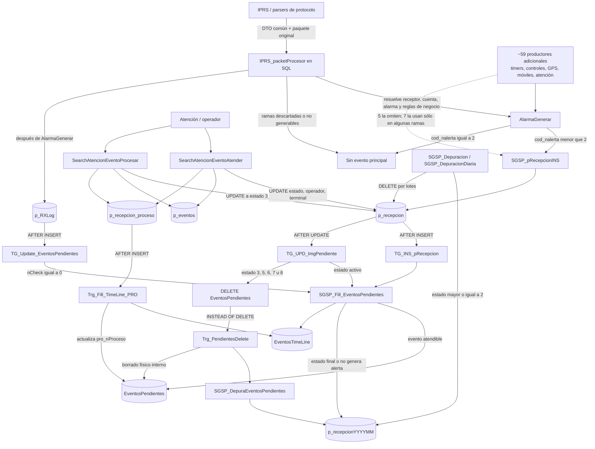

# Flujo principal de eventos

> Estado: borrador inicial basado en los objetos SQL versionados en el repositorio.
> El objetivo es convertir este documento en un mapa navegable de los distintos
> flujos de recepción, atención, procesamiento y depuración de eventos.

## Alcance de esta primera versión

Esta primera pasada cubre el camino principal:

1. recepción desde IPRS de un DTO ya interpretado por su parser;
2. normalización de negocio y generación del evento en SQL;
3. persistencia en `p_recepcion`;
4. creación y enriquecimiento de `EventosPendientes`;
5. toma del evento por un operador;
6. procesamiento o cierre;
7. copia a históricos y depuración.

No se documentan todavía en detalle las ramas de eventos manuales, programados,
SMS, Operador Virtual, autoatención, móviles, restauraciones y controles
especiales. Se muestran cuando forman parte del flujo principal, pero quedan
marcadas como extensiones.

### Advertencia sobre el alcance

Este documento describe **un** camino, no el único. `IPRS_packetProcesor` es uno
de aproximadamente sesenta productores de eventos del sistema. El resto —
temporizadores, controles de supervisión, telemetría GPS, móviles, órdenes de
servicio y el propio flujo de atención — genera eventos por vías que no aparecen
en el grafo de abajo.

El inventario completo está en
[`productores-de-eventos.md`](productores-de-eventos.md). Conviene leerlo antes
de tomar el grafo siguiente como el modelo del sistema: el flujo real tiene
ciclos y múltiples entradas, no la forma lineal que sugiere esta primera pasada.

## Resumen conceptual

- `p_recepcion` es el registro operativo canónico del evento.
- `EventosPendientes` es una proyección desnormalizada para búsqueda y atención.
  Contiene datos del evento, cuenta, zona, operador, receptor, multimedia,
  ubicación, prioridad y organización.
- `p_RXLog` conserva el paquete o log crudo asociado al evento. Su inserción
  vuelve a ejecutar el llenado de `EventosPendientes` para completar datos que no
  estaban disponibles durante el primer `INSERT`.
- `p_recepcion_proceso` registra las transiciones de atención.
- `EventosTimeLine` registra la historia legible/auditable de acciones.
- `p_recepcionYYYYMM` conserva la versión histórica mensual. La tabla física se
  crea en `_History` y `_Datos` accede mediante un sinónimo.

`rec_iid` es la identidad lógica que conecta estas estructuras.

## Grafo principal

## Secuencia del alta

### 1. Recepción del DTO y normalización SQL

[`IPRS_packetProcesor`](../../database/_Desktop/StoredProcedures/IPRS_packetProcesor.sql)
recibe los valores producidos por el parser de IPRS. El procedimiento:

- determina receptor y conexión;
- resuelve la cuenta;
- normaliza zona, partición, usuario y código de alarma;
- aplica reglas de descarte, duplicados, cuentas no habilitadas y protocolos
  especiales;
- resuelve si corresponde generar un evento;
- llama a `AlarmaGenerar` y obtiene el nuevo `rec_iid`;
- después del alta agrega información complementaria, incluyendo `p_RXtraInfo`
  y `p_RXLog`.

El nombre `IPRS_packetProcesor` no significa que el procedimiento decodifique el
paquete propietario: esa interpretación ya ocurrió en los parsers de IPRS. Sus
ramas por parser/protocolo realizan ajustes, búsquedas y efectos posteriores al
parseo. El nodo común del flujo principal es la llamada a
[`AlarmaGenerar`](../../database/_Desktop/StoredProcedures/AlarmaGenerar.sql).

### 2. Generación y estado inicial

`AlarmaGenerar` consulta `t_codigos_alarma` y utiliza `cod_nalerta` para decidir:

| `cod_nalerta` | Resultado principal |
|---|---|
| `2` | No se crea una fila en `p_recepcion`. |
| `1` | Se crea el evento con estado inicial `0` (pendiente). |
| `0` | Se crea con estado `5` (no genera alerta/autoprocesado). |

Existen reglas que pueden cambiar el código o el estado antes de persistirlo.
Por eso esta tabla describe la regla general, no todas las excepciones.

La escritura se delega a `[_Datos].[dbo].[SGSP_pRecepcionINS]`. La definición de
este procedimiento no está versionada actualmente en `database`, aunque sí
están versionadas sus llamadas. Esta ausencia impide documentar todavía:

- cómo se genera exactamente `rec_iid`;
- todos los valores por defecto;
- validaciones y efectos secundarios internos;
- si existe lógica adicional anterior al `INSERT`.

#### `SGSP_pRecepcionINS` es el único punto de creación del sistema

El repositorio **no contiene ninguna sentencia `INSERT INTO p_recepcion`**. Todo
alta de evento, venga de donde venga, pasa por este procedimiento. Es el embudo
real del sistema, y `AlarmaGenerar` no lo es: seis productores la omiten por
completo y otros seis la usan sólo en algunas de sus ramas, escribiendo directo
en las demás.

Esto convierte la ausencia de su definición en un prerrequisito bloqueante, no en
una nota al pie:

- es el contrato de creación de eventos de toda la plataforma;
- es el único punto donde instrumentar la captura de tráfico para comparar el
  comportamiento legado con una implementación nueva;
- cualquier regla que se suponga universal pero viva en `AlarmaGenerar` no se
  aplica a esos once caminos.

Existen además dos variantes de generación con lógica propia: `AlarmaGenerar` en
`_Desktop` y `SGSP_AlarmaGenerar` en `_Datos`. `IPRS_packetProcesor` usa ambas
según la rama. Su diferencia todavía no está documentada.

Detalle y clasificación de los productores en
[`productores-de-eventos.md`](productores-de-eventos.md).

### 3. Creación de la proyección atendible

El `INSERT` en `p_recepcion` dispara
[`TG_INS_pRecepcion`](../../database/_datos/Triggers/dbo.p_recepcion.TG_INS_pRecepcion.sql),
que llama a
[`SGSP_Fill_EventosPendientes`](../../database/_datos/StoredProcedures/SGSP_Fill_EventosPendientes.sql).

`SGSP_Fill_EventosPendientes`:

- lee el evento canónico desde `p_recepcion`;
- determina si debe ser atendido o archivado directamente;
- desnormaliza datos de cuenta, zona, usuario, receptor, multimedia,
  geolocalización, prioridad y organización;
- inserta o actualiza `EventosPendientes`;
- agrega el inicio a `EventosTimeLine`;
- puede abrir ramas como Operador Virtual o autoasignación.

`TG_INS_pRecepcion` también dispara controles laterales:

- `SGSP_IRSRedirectorEventos`;
- `SGSP_IRSEstadosDinamicos`;
- `SGSP_ControlEstadoPanel`;
- `SGSP_AutoProcesoEvento`;
- `SGSP_ControlCierre`, para `OPV`, `OSA` y `OPF`;
- `SGSP_NotificacionEncuesta`, para `_ST`;
- `SGSP_FillEventosIngEgr`, según el contenido;
- `SGSP_ControlEventosDealer`.

Estas llamadas son extensiones del alta y deben analizarse como subgrafos.

### 4. Enriquecimiento con el paquete crudo

Después de `AlarmaGenerar`, `IPRS_packetProcesor` inserta el paquete en
`p_RXLog`. El trigger
[`TG_Update_EventosPendientes`](../../database/_datos/Triggers/dbo.p_RXLog.TG_Update_EventosPendientes.sql)
llama nuevamente a `SGSP_Fill_EventosPendientes`, esta vez con `@nCheck = 0`.

Esto explica por qué el llenado soporta tanto `INSERT` como `UPDATE`: la primera
ejecución crea la proyección y la segunda puede agregar `rxl_cLog`,
`rxl_cEvento` y otros datos que llegaron después.

## Atención del evento

### Tomar: `SearchAtencionEventoAtender`

[`SearchAtencionEventoAtender`](../../database/_Desktop/StoredProcedures/SearchAtencionEventoAtender.sql):

1. resuelve token, usuario, operador y terminal;
2. lee el evento desde `p_recepcion`;
3. dentro de una transacción bloquea filas de la cuenta para evitar que dos
   operadores tomen simultáneamente el mismo trabajo;
4. valida si la cuenta o el evento ya están tomados;
5. actualiza `p_recepcion` con operador, terminal y fecha de proceso;
6. inserta o actualiza `p_eventos`, que representa la ocupación/actividad de la
   cuenta en una terminal;
7. inserta una transición en `p_recepcion_proceso`.

Transiciones generales:

| Estado anterior | Acción | Estado nuevo | `pro_nProceso` |
|---|---|---:|---:|
| `0`, pendiente | Tomar | `1` | `11` |
| `0`, pendiente | Procesa Todo | `9` | `14` |
| `2`, espera | Tomar | `4` | `21` |
| `2`, espera | Procesa Todo | `9` | `24` |

Hay variantes para eventos supervisados, determinadas por el proceso anterior.

El `UPDATE` sobre `p_recepcion` activa `TG_UPD_ImgPendiente`, que para estados
activos vuelve a llamar a `SGSP_Fill_EventosPendientes` y sincroniza la
proyección.

### Resolver: `SearchAtencionEventoProcesar`

[`SearchAtencionEventoProcesar`](../../database/_Desktop/StoredProcedures/SearchAtencionEventoProcesar.sql):

1. valida operador, resolución y categorización;
2. rechaza un evento que ya tenga estado `3`;
3. actualiza `p_eventos`;
4. completa observaciones, resolución y categorización;
5. cambia `p_recepcion.rec_nEstado` a `3`;
6. cierra chats activos;
7. inserta la transición en `p_recepcion_proceso`;
8. actualiza el contador de falsas alarmas cuando corresponde;
9. desasigna móviles asociados;
10. agrega comentarios a `EventosTimeLine`.

Procesos generales de cierre:

| Estado anterior | Resultado | `pro_nProceso` |
|---|---|---:|
| `0` o estado no especializado | Procesado | `12` |
| `9` | Procesa Todo - procesado | `33` |
| `2` o `4` | Espera - procesado | `22` |
| Proceso anterior supervisado | Supervisor - procesado | `43` |

## Sincronización, cierre e históricos

### Actualización de `p_recepcion`

[`TG_UPD_ImgPendiente`](../../database/_datos/Triggers/dbo.p_recepcion.TG_UPD_ImgPendiente.sql)
es el enlace principal entre los cambios del registro canónico y la proyección:

- estados activos: llama a `SGSP_Fill_EventosPendientes`;
- estados `3`, `5`, `6`, `7` u `8`: elimina la fila de `EventosPendientes`;
- también contiene lógica de multimedia y actualización de registros ya
  depurados.

### Eliminación de `EventosPendientes`

[`Trg_PendientesDelete`](../../database/_datos/Triggers/dbo.EventosPendientes.Trg_PendientesDelete.sql)
es `INSTEAD OF DELETE`. Antes del borrado físico:

1. llama a
   [`SGSP_DepuraEventosPendientes`](../../database/_datos/StoredProcedures/SGSP_DepuraEventosPendientes.sql);
2. copia la proyección a `p_recepcionYYYYMM`, si todavía no existe allí;
3. si el evento aún tenía estado `0`, lo convierte a `3` en la copia histórica;
4. ejecuta el borrado físico desde dentro del propio trigger.

### Depuración periódica de `p_recepcion`

[`SGSP_Depuracion`](../../database/_datos/StoredProcedures/SGSP_Depuracion.sql)
y
[`SGSP_DepuracionDiaria`](../../database/_datos/StoredProcedures/SGSP_DepuracionDiaria.sql)
mueven por lotes eventos con `rec_nEstado >= 2` desde `p_recepcion` al histórico
mensual y eliminan el original.

[`SGSP_CreoPRDepurado`](../../database/_datos/StoredProcedures/SGSP_CreoPRDepurado.sql)
crea:

- la tabla física `_History.dbo.p_recepcionYYYYMM`;
- índices por evento, cuenta, fecha y puerto;
- el sinónimo `_Datos.dbo.p_recepcionYYYYMM`;
- el registro correspondiente en `s_tablahistoricos`.

El `DELETE` de `p_recepcion` dispara lógica adicional para depurar
`EventosPendientes`, `p_recepcion_proceso`, `p_recepcion_notas`, `p_RXLog`,
`p_RXImg`, `p_RXtraInfo` y `EventosTimeLine`.

## Estados observados

| `rec_nEstado` | Significado confirmado o inferido del código |
|---:|---|
| `0` | Nuevo / pendiente. |
| `1` | Siendo procesado desde pendientes. |
| `2` | En espera. |
| `3` | Procesado / finalizado. |
| `4` | Tomado/procesando desde espera. |
| `5` | Autoprocesado o código que no genera alerta. |
| `6` | Cuenta en **modo prueba**. El evento se archiva sin atención. |
| `7` | Cuenta **no habilitada / inhabilitada**. |
| `8` | Evento de **llamado telefónico** (CallerID existente). |
| `9` | Estado temporal usado por Procesa Todo. |

`rec_nEstado` describe el estado operativo general. `pro_nProceso` aporta una
transición más específica y se obtiene de `t_StatusProceso`.

### Evidencia de los estados `6`, `7` y `8`

Los tres estaban sin identificar en la primera versión. Se resolvieron por
código:

| Estado | Escritor | Evidencia |
|---:|---|---|
| `6` | [`SGSP_TimerControlUsuario`](../../database/_datos/StoredProcedures/SGSP_TimerControlUsuario.sql) | Asigna `6` cuando la situación de la cuenta es `Prueba` o `Prueba x Zonas`, y toma la resolución del parámetro `MODO PRUEBA`. |
| `7` | [`SGSP_TimerControlUsuario`](../../database/_datos/StoredProcedures/SGSP_TimerControlUsuario.sql) y [`TG_UPD_Estado_Alarma_m_estado_cuenta_cab`](../../database/_datos/Triggers/dbo.m_estado_cuenta_cab.TG_UPD_Estado_Alarma_m_estado_cuenta_cab.sql) | El primero asigna `7` con la cuenta `No Habilitado`. El segundo pasa a `7` **todos** los eventos en estado `0` o `2` de la cuenta al cambiar su estado. |
| `8` | [`AlarmaGenerar`](../../database/_Desktop/StoredProcedures/AlarmaGenerar.sql) y [`SGSP_SofIAVoiceCallProcessParsedEvent`](../../database/_datos/StoredProcedures/SGSP_SofIAVoiceCallProcessParsedEvent.sql) | `AlarmaGenerar` registra "evento de CallerID existente lo grabo con estado 8". |

Las descripciones de usuario coinciden en
[`SearchUltimos25EventosAlertas`](../../database/_Desktop/StoredProcedures/SearchUltimos25EventosAlertas.sql)
y `WebManager_EventosAutoprocesados`: "Procesado (Modo prueba)", "Cuenta
Inhabilitada" y "Llamado telefónico".

El caso de `7` merece atención en un rediseño: **un cambio de estado de la cuenta
cancela en masa los eventos pendientes de esa cuenta**. Es una transición
multi-agregado disparada desde otro contexto de negocio, no una transición del
evento individual.

## Rol de los triggers relevados

| Tabla | Trigger | Evento | Responsabilidad principal |
|---|---|---|---|
| `p_recepcion` | `TG_INS_pRecepcion` | `AFTER INSERT` | Crear proyección y ejecutar controles laterales. |
| `p_recepcion` | `TG_UPD_AcumuladosPrioridad` | `AFTER INSERT` | Calcular prioridad y controles acumulados; puede generar `UPDATE`. |
| `p_recepcion` | `TG_UPD_ImgPendiente` | `AFTER UPDATE` | Sincronizar o quitar `EventosPendientes`; multimedia e históricos. |
| `p_recepcion` | `Trg_EventoDelete` | `AFTER DELETE` | Depuración sincrónica de tablas relacionadas. |
| `p_recepcion` | `Trg_EventoDelete_Async` | `AFTER DELETE` | Encolar depuración asíncrona por lotes. |
| `p_RXLog` | `TG_Update_EventosPendientes` | `AFTER INSERT` | Enriquecer la proyección con el paquete crudo. |
| `EventosPendientes` | `Trg_PendientesUpdate` | `AFTER UPDATE` | Actualizar `_Update`. |
| `EventosPendientes` | `Trg_PendientesDelete` | `INSTEAD OF DELETE` | Copiar al histórico antes de borrar. |
| `p_recepcion_proceso` | `Trg_Fill_TimeLine_PRO` | `AFTER INSERT` | Registrar timeline y actualizar `pro_nProceso`. |

La presencia simultánea en el repositorio de `Trg_EventoDelete` y
`Trg_EventoDelete_Async` requiere validación en una base desplegada. El segundo
se describe como reemplazo del primero, pero los scripts usan nombres distintos
y no incluyen un `DISABLE TRIGGER`; si ambos están habilitados, ambos se
ejecutarían.

## Observaciones estructurales

Tres características del modelo actual que condicionan cualquier rediseño.

### La organización no vive en el evento canónico

`p_recepcion` **no tiene ninguna columna de organización ni de dealer**.
`EventosPendientes` sí: `_idOrganizacion` y `zon_cDealer`, con tres índices que
los usan (`NC_EP_Organizacion`, `NC_EP_EstadoOrgFecha`, `NC_EP_cDealerCuenta`).

Es decir: **la dimensión de autorización se materializa recién en la proyección**,
derivada de la cuenta por `SGSP_Fill_EventosPendientes`. El registro canónico no
sabe a quién le corresponde.

Consecuencia para un pipeline nuevo: la resolución de cuenta queda en el camino
crítico y no puede diferirse. Sin cuenta resuelta no hay organización ni dealer,
y sin ellos no se puede decidir a qué operador entregar el evento.

### La concurrencia es por cuenta, no por evento

`SearchAtencionEventoAtender` bloquea filas **de la cuenta**, y `p_eventos`
representa la ocupación de la cuenta en una terminal. El invariante real es *un
operador ocupa una cuenta*, no *un operador toma un evento*.

"Procesa Todo" (estado `9`) confirma la lectura: es una operación sobre el
conjunto de eventos de una cuenta. El paso a estado `7` por cambio de estado de
la cuenta, también.

Cualquier modelo que elija el evento individual como unidad de consistencia debe
resolver aparte este invariante de nivel cuenta.

### Concentración del código

| Objeto | Líneas |
|---|---:|
| `IPRS_packetProcesor` | 2.848 |
| `SGSP_Fill_EventosPendientes` | 1.676 |
| `AlarmaGenerar` | 851 |
| `SearchAtencionEventoProcesar` | 377 |
| `SearchAtencionEventoAtender` | 306 |
| `TG_UPD_ImgPendiente` | 182 |
| `TG_INS_pRecepcion` | 132 |
| **Total del camino principal** | **6.372** |

Son sólo los siete objetos de este documento, sin contar los controles laterales
ni los ~60 productores. Cualquier estimación de esfuerzo de relevamiento debe
partir de este orden de magnitud.

## Puntos a validar en la próxima iteración

1. **Obtener la definición desplegada de `SGSP_pRecepcionINS`.** Prerrequisito
   bloqueante: es el único punto de creación de eventos del sistema.
2. Documentar la diferencia entre `AlarmaGenerar` (`_Desktop`) y
   `SGSP_AlarmaGenerar` (`_Datos`), y por qué `IPRS_packetProcesor` usa ambas.
3. Consultar `t_StatusProceso` para completar el catálogo de `pro_nProceso`.
4. Verificar qué trigger de borrado de `p_recepcion` está habilitado en
   producción.
5. Confirmar el orden y la convivencia de los dos triggers `AFTER INSERT` de
   `p_recepcion`; SQL Server no garantiza un orden general salvo configuración
   explícita de primero/último.
6. Separar en subgrafos los flujos de autoatención, espera, Procesa Todo,
   Operador Virtual, eventos manuales, SMS y eventos programados.
7. Revisar `EventoDeleteQueue` y sus consumidores para cerrar el flujo de
   depuración asíncrona.
8. Construir el grafo de reentrada: qué eventos generan eventos, y con qué
   profundidad máxima de ciclo.
9. Validar contra una base desplegada cuáles de los ~60 productores están
   efectivamente habilitados.

Resuelto desde la primera versión: el significado de los estados `6`, `7` y `8`.

## Objetos fuente principales

- [`IPRS_packetProcesor`](../../database/_Desktop/StoredProcedures/IPRS_packetProcesor.sql)
- [`AlarmaGenerar`](../../database/_Desktop/StoredProcedures/AlarmaGenerar.sql)
- [`p_recepcion`](../../database/_datos/Tables/dbo.p_recepcion.sql)
- [`EventosPendientes`](../../database/_datos/Tables/dbo.EventosPendientes.sql)
- [`p_recepcion_proceso`](../../database/_datos/Tables/dbo.p_recepcion_proceso.sql)
- [`SGSP_Fill_EventosPendientes`](../../database/_datos/StoredProcedures/SGSP_Fill_EventosPendientes.sql)
- [`SearchAtencionEventoAtender`](../../database/_Desktop/StoredProcedures/SearchAtencionEventoAtender.sql)
- [`SearchAtencionEventoProcesar`](../../database/_Desktop/StoredProcedures/SearchAtencionEventoProcesar.sql)
- [`SGSP_DepuraEventosPendientes`](../../database/_datos/StoredProcedures/SGSP_DepuraEventosPendientes.sql)
- [`SGSP_DepuracionDiaria`](../../database/_datos/StoredProcedures/SGSP_DepuracionDiaria.sql)
