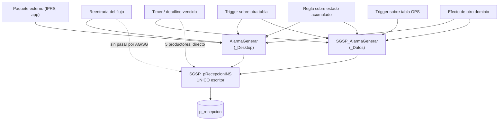

# Productores de eventos

> Estado: inventario revisado con lectura directa del código fuente.
> La clasificación por familia está basada en el mecanismo de generación, no
> en quién llama a qué. Debe validarse contra una base desplegada antes de
> convertirse en plan de migración.

## 1. Por qué existe este documento

[`flujo-principal-eventos.md`](flujo-principal-eventos.md) describe el camino
IPRS → `AlarmaGenerar` → `p_recepcion` → `EventosPendientes`.
[`arquitectura-eventos-tiempo-real.md`](arquitectura-eventos-tiempo-real.md)
propone reemplazar ese camino por un pipeline con Ingress API, Normalizer y
Alarm Domain Engine.

Ambos documentos podían leerse como si `IPRS_packetProcesor` fuera *la* puerta de
entrada de eventos. No lo es. Es uno de los caminos de entrada, pero existen
mecanismos de generación completamente distintos que no pasan por IPRS.

Esta diferencia cambia qué componentes necesita la arquitectura objetivo y en qué
orden se puede migrar.

## 2. El embudo real de escritura

Hechos verificados sobre el repositorio:

| Medición | Valor |
|---|---:|
| Archivos que llaman a `AlarmaGenerar` o `SGSP_AlarmaGenerar` | 55 |
| Archivos que llaman a `SGSP_pRecepcionINS` (incluye las 2 generadoras) | 14 |
| Productores que omiten `AlarmaGenerar` por completo | 6 |
| Productores que usan **ambos** caminos según la rama | 6 |
| `INSERT INTO p_recepcion` fuera de un procedimiento | 0 |

> Los conteos descartan llamadas comentadas, tanto de línea (`--`) como de
> bloque (`/* */`), y contemplan `EXEC` partidos en varias líneas. Contar sin
> descartar comentarios sobreestima: hay procedimientos cuyas únicas llamadas a
> `AlarmaGenerar` están dentro de un bloque comentado.

### 2.1 `SGSP_pRecepcionINS` es el único escritor de `p_recepcion`

No existe ningún `INSERT INTO p_recepcion` en el repositorio fuera de ese SP.
Todo alta de evento pasa por `SGSP_pRecepcionINS`.

Consecuencias opuestas y ambas importantes:

- **A favor de la migración.** Un único punto donde interceptar el 100% de
  las altas para shadow traffic. No hace falta instrumentar 60 productores.
- **Bloqueante actual.** Es el único objeto del camino principal cuya definición
  **no está versionada** en `database`. El repositorio tiene sus llamadas en
  14 archivos, pero no su cuerpo. Obtenerlo es prerrequisito para cualquier
  plan de migración.

### 2.2 `AlarmaGenerar` no es un embudo

Seis productores llaman a `SGSP_pRecepcionINS` sin pasar nunca por
`AlarmaGenerar`: `GeneroOPV`, `SGSP_BuscoOrdenSTVencidas`,
`SGSP_ControlFalsasAlarmas`, `SGSP_Inactividad`, `SGSP_Test` y
`Trg_EstadosDinamicosUpdate`.

Otros seis usan los dos caminos según la rama: `IPRS_packetProcesor`,
`EstadoUpd_Enhanced`, `SGSP_SofIAVoiceCallProcessParsedEvent`,
`SGSP_TimerControlUsuario`, `SGSP_TimerGeneroEVT` y `SGSP_TimerGeneroNY`.

`Trg_EstadosDinamicosUpdate` aparenta usar ambos caminos, pero sus dos llamadas
a `AlarmaGenerar` están comentadas; las tres vivas van a `SGSP_pRecepcionINS`.
Pertenece al primer grupo.

Cualquier regla implementada dentro de `AlarmaGenerar` (huso horario, geocerca,
`cod_nalerta`, notificaciones, `m_status`) se aplica **sólo a algunas ramas**
de esos procedimientos. Portarla al Normalizer asumiendo universalidad cambiaría
el comportamiento de las ramas que la evitan.

Además existen dos variantes con lógica propia: `AlarmaGenerar` en `_Desktop` y
`SGSP_AlarmaGenerar` en `_Datos`. La relación entre ellas debe documentarse antes
de portar cualquiera.

## 3. Mecanismos de generación

El inventario está organizado por **mecanismo de generación**, no por quién llama
a quién. La pregunta relevante para la migración es: ¿qué hecho del mundo real
dispara el evento?

### M1 — Paquete externo recibido por IPRS

Un receptor recibe un paquete de red y lo delega a `IPRS_packetProcesor`, que
llama a `AlarmaGenerar`. Todos los protocolos soportados (paneles, GPS,
SmartPanics via `SMARTPANICSHTTP`/`SmartPanicsPacketParser`, Vigicontrol, acceso,
voz) **entran por este único punto** cuando llegan vía receptor IPRS.

| Objeto | Rol |
|---|---|
| `IPRS_packetProcesor` | Parser y despachador central |
| `terminalRemotaPacketParser` | Terminal remota (variante de protocolo) |

Las posiciones GPS de SmartPanics y Vigicontrol son procesadas por IPRS cuando
arriban como paquetes. El evento de alarma lo genera el propio
`IPRS_packetProcesor` al llamar a `AlarmaGenerar`.

**Destino en arquitectura objetivo:** Ingress API con `IPRS_packetProcesor` como
productor principal. Ya cubierto en el contrato `contrato-ingress-iprs.md`.

### M2 — Posición GPS fuera de IPRS (SmartPanic / VigiControl API)

Algunos clientes envían posiciones directamente a una API HTTP, no a un receptor
IPRS. El SP las ingresa en `p_posicionesSP` y, condicionalmente, genera el evento
`SPP` (posición SmartPanic).

| Objeto | Condición de generación |
|---|---|
| `p_posicionesSPInsTecguard` | Genera evento `SPP` solo si `cod_nalerta != 2` para ese tipo de evento |
| `p_posicionesSPInsOLD` | Legado; mismo mecanismo |

Estos SPs **no pasan por IPRS**. Son un ingreso independiente que hoy ya
convive con el flujo IPRS para las mismas cuentas.

**Destino:** adaptador de ingreso propio en la Ingress API, o incorporarlos al
path IPRS si el volumen no justifica un ingreso separado. El `cod_nalerta` que
controla si genera evento implica que la lógica de negocio está mezclada con el
ingreso.

### M3 — Lifecycle de cuenta SmartPanic (sin paquete)

Eventos que se generan cuando cambia el estado de la entidad `SmartPanic` en la
base, no cuando llega un paquete.

| Objeto | Condición | Alarmas |
|---|---|---|
| `SmartPanicAltaEvent` | Alta de dispositivo con / sin IMEI | `_AN` (activo con IMEI), `_AT` (alta temprana) |
| `TG_SmartPanicUpdate` | `pushToken` cambia en la tabla `SmartPanic` | `_DC` (device changed) |

Ambos son disparados desde la lógica de administración de cuentas, no desde
tráfico de red. `TG_SmartPanicUpdate` es un trigger `AFTER UPDATE` sobre
`_Datos.SmartPanic`. `SmartPanicAltaEvent` es un SP llamado explícitamente tras
el alta.

**Destino:** eventos de dominio del contexto "Gestión de Cuentas" que se publican
como `AccountDeviceChanged` / `AccountActivated`. No pertenecen al pipeline de
alarmas en tiempo real.

### M4 — Reglas sobre posición GPS

Triggers sobre `_Datos.p_Gps` que evalúan reglas al actualizarse la posición.
`p_Gps` es la tabla de **última posición conocida** (una fila por cuenta). Los
triggers son `INSTEAD OF`, lo que significa que interceptan cada write y de paso
aplican la regla.

| Objeto | Tabla observada | Regla | Alarmas |
|---|---|---|---|
| `Trg_Ins_Gps` | `_Datos.p_Gps` (INSERT) | Exceso de velocidad, parking | `_XV`, `_MP` |
| `Trg_Upd_Gps` | `_Datos.p_Gps` (UPDATE) | Exceso de velocidad, parking | `_XV`, `_MP` |
| `trg_AfterUpdate_EngineStatus` | `_Datos.p_Gps` (UPDATE) | Cambio de estado de motor | `LME` (encendido), `LMA` (apagado) |

Importante: estos triggers **no son el camino de entrada de posiciones GPS**. Las
posiciones llegan vía IPRS y `AlarmaGenerar` hace el INSERT/UPDATE en `p_Gps`
como efecto secundario. Los triggers se disparan como consecuencia de ese write.
El ciclo es: `IPRS_packetProcesor` → `AlarmaGenerar` → UPDATE `p_Gps` →
`Trg_Upd_Gps` → `SGSP_AlarmaGenerar` (_XV / _MP).

**Destino:** reglas del Alarm Domain Engine que consumen el stream de posiciones
y evalúan exceso de velocidad / parking / estado de motor. Requieren estado por
cuenta (velocidad máxima configurada, estado anterior del motor).

### M5 — Geocercas y viajes (evaluación periódica sobre `p_PosicionesGPS`)

`GeoFenceExecute` es un SP invocado periódicamente por un job. Lee las
posiciones nuevas de `p_PosicionesGPS` usando un watermark (`GEOFENCELASTID`) y
evalúa si hubo ingreso/egreso de geocercas o inicio/fin de viajes programados.

| Objeto | Input | Alarmas |
|---|---|---|
| `GeoFenceExecute` | `p_PosicionesGPS` (desde watermark) | `_IG`, `_EG`, `_FR`, `_IV`, `_VR`, `_VT`, `_FV`, `_LR`, `_LT` |

Este mecanismo **no está integrado en IPRS**. Es completamente independiente:
lee posiciones ya guardadas y genera eventos con latencia igual al período del
job. `p_PosicionesGPS` es el historial de posiciones (muchas filas por cuenta),
distinta de `p_Gps` (última posición, una fila por cuenta).

**Destino:** procesador de stream de posiciones con estado de geocercas por
cuenta. Es el ejemplo más claro de una regla que necesita estado acumulado
(estado anterior dentro/fuera de la geocerca) y que hoy tolera latencia del
barrido.

### M6 — Control de acceso físico

| Objeto | Tabla observada | Alarmas |
|---|---|---|
| `CAIO_genera_evento` | `_Datos.p_controlAcceso_IO` (AFTER INSERT) | `_IN` (ingreso), `_SA` (salida) |

Trigger sobre la tabla de registro de accesos. Cada registro de E/S de una
persona genera un evento de alarma hacia la cuenta asociada al usuario.

**Destino:** adaptador de ingreso propio o evento de dominio de "Control de
Acceso". No pasa por IPRS.

### M7 — Timers y vencimientos (deadlines durables)

Nada llega de afuera. El evento se genera porque **pasó el tiempo** sin que
ocurriera algo esperado, o porque venció un plazo. Son SPs invocados
periódicamente por jobs SQL que barren tablas.

| Objeto | Disparador |
|---|---|
| `SGSP_TimerExecute` | Motor de timers general (apertura/cierre, test, etc.) |
| `SGSP_TimerExecuteRestauraciones` | Restauraciones vencidas |
| `SchedulerExecute` | Eventos programados por configuración |
| `SGSP_TimerGeneroEVT` | Evento programado (delegado desde TimerExecute) |
| `SGSP_TimerGeneroNY` | Evento programado (delegado desde TimerExecute) |
| `SGSP_TimerControlUsuario` | Control de apertura/cierre por usuario |
| `SGSP_Inactividad` | Falta de actividad de la cuenta |
| `SGSP_ControlTSTConexion` | Testeo periódico no recibido |
| `SGSP_ControlTesteoSmartPanic` | Testeo periódico no recibido |
| `SGSP_ControlTesteoVigicontrol` | Testeo periódico no recibido |
| `SGSP_VerificaControlCierre` | Cierre no reportado |
| `SGSP_ControlCierreParticiones` | Cierre de partición no reportado |
| `SGSP_ControlEventosDealerSinAtencionGenerar` | Evento sin atención en plazo |
| `SGSP_EvaluarControlEventosDealer` | Evento sin atención en plazo |
| `SGSP_BuscoOrdenSTVencidas` | Orden de servicio vencida |
| `TgViajeFinalizarVencido` | Viaje vencido |
| `TaskStatus_AddAlarmForUnresponsiveJob` | Job sin respuesta |
| `IPRS_RestauraComunicacion` | Comunicación restaurada |
| `RestaurarEventosEnFalloRestauracionSearch` | Restauración fallida |

**Destino: componente nuevo, no previsto en la arquitectura actual.**

Casi veinte productores son **deadlines durables**: "si dentro de N minutos no
llegó X, generá el evento Y". La arquitectura objetivo necesita un
`Alarm Timer Service` con responsabilidades propias:

- registrar un deadline al ocurrir un hecho (`AlarmTimerScheduled`);
- cancelarlo si llega el hecho esperado (`AlarmTimerCancelled`);
- dispararlo exactamente una vez al vencer (`AlarmTimerFired`);
- sobrevivir al reinicio sin perder ni duplicar vencimientos;
- reconciliar al arrancar tras una caída;
- escalar sin barrer la tabla completa.

**Nota de SLO:** P95 < 1 s no aplica a esta familia. La latencia la define
el período de barrido del job. Los SLO deben separarse por mecanismo.

### M8 — Reglas sobre estado acumulado (sin GPS)

El evento se genera al evaluar una regla contra el historial de la cuenta, no
contra un paquete individual ni una posición.

| Objeto | Regla |
|---|---|
| `SGSP_ControlExcesoEventos` | Límite de eventos por hora y por día |
| `SGSP_ControlFalsasAlarmas` | Acumulado de falsas alarmas |
| `SGSP_TestUsoCuenta` | Uso de la cuenta |
| `SGSP_ControlLogOutVigicontrol` | Sesión de Vigicontrol |
| `vigicontrol_restricciones_execute` | Restricciones de Vigicontrol |
| `TrackGuard_Restriccion_exec` | Restricciones de TrackGuard |
| `SystemTestAnalyze` | Análisis de testeo del sistema |

**Destino:** procesador de políticas que consuma el stream y mantenga estado
agregado por cuenta. Requieren ventana temporal ("cuántos eventos en la última
hora"), que es procesamiento de streams, no transformación pura.

### M9 — Efectos de otros dominios

Otro contexto de negocio cambia y produce un evento de alarma como efecto
colateral.

| Objeto | Dominio origen | Alarmas |
|---|---|---|
| `trg_asignacion_movil_Eventos` | Asignación de móviles | varias |
| `m_st_cabecera_INSERT` | Órdenes de servicio | `_NS` |
| `sertecCreaDesdeSp` | Órdenes de servicio | varias |
| `TG_mantenimiento_AlarmaGenerar` | Mantenimiento | varias |
| `TG_mantenimientoKM_AlarmaGenerar` | Mantenimiento por km | varias |
| `Trg_iStatusRD_Update` | Info extra de cuenta | configurable |
| `TG_UPD_Estado_Alarma` | Reporte a autoridades | `_RA` |
| `TG_INS_EventosInformados` | Eventos informados | `_DE` |
| `p_encuesta_estadoUpdate` | Encuestas | configurable |
| `Trg_EstadosDinamicosUpdate` | Estados dinámicos | varias |
| `EstadoUpd_Enhanced` | Cambio de estado | varias |
| `CA_vehiculo_AlarmaGenerar` | Vencimiento seguro/VTV | `_VS`, `_VV` |
| `trg_AfterUpdate_EngineStatus` | Estado de motor en GPS | `LME`, `LMA` |

**Destino:** comando `GenerateAlarm` publicado por cada contexto, en lugar de un
trigger que escribe directo. Es la familia que mejor justifica exponer el comando
temprano.

### M10 — Reentrada del flujo de atención

El propio dominio de alarmas produce nuevas alarmas al procesar las existentes.

| Objeto | Situación |
|---|---|
| `TG_UPD_ImgPendiente` | Trigger en el camino principal genera alarmas (`_VA`) |
| `SGSP_ProcesoEscalamiento` | Escalamiento de guardia (`_EO`, `_ES`, `_ET`) |
| `GeneroOPV` | Operador Virtual |

**Destino:** dentro del Alarm Domain Engine, como transiciones de estado que
emiten hechos. Estos casos introducen ciclos en el grafo de flujo: no hay un
camino lineal del dispositivo al histórico.

> `SearchAtencionEventoProcesar` **no** pertenece a este mecanismo. Sus dos
> `EXEC AlarmaGenerar` están dentro de un bloque `/* */` y no llama a
> `SGSP_pRecepcionINS`: hoy no genera ningún evento. El cierre de un evento no
> produce otro. El ciclo de reentrada existe, pero entra por
> `TG_UPD_ImgPendiente`, no por el procedimiento de cierre.

### M11 — Wrappers y herramientas

| Objeto | Nota |
|---|---|
| `AlarmaGenerarInter` | Wrapper sobre `AlarmaGenerar` |
| `AlarmaGenerarMultimedia` | Wrapper sobre `AlarmaGenerar` |
| `SGSP_Test` | Herramienta de test; hace `UPDATE` directo a estado 5 |

## 4. Consecuencias para la arquitectura objetivo

### 4.1 Lo que ya cubre el contrato actual

El contrato `contrato-ingress-iprs.md` cubre M1 (paquetes IPRS). Es el mecanismo
de mayor volumen y el más importante para una primera fase. Todos los dispositivos
que usan receptores IPRS — incluyendo SmartPanics y Vigicontrol cuando envían
por IPRS — entran por aquí.

### 4.2 Lo que no cubre y necesita trabajo

| Mecanismo | Por qué no entra por IPRS | Dónde vive hoy |
|---|---|---|
| M2 — Posiciones API | HTTP directo, sin receptor | `p_posicionesSPInsTecguard` |
| M3 — Lifecycle SmartPanic | Cambio en tabla, no paquete | Trigger + SP de admin |
| M4 — Reglas GPS | Trigger INSTEAD OF en `p_Gps` | Disparo síncrono con el write |
| M5 — Geocercas | Polling periódico de `p_PosicionesGPS` | Job SQL con watermark |
| M6 — Control de acceso | Trigger en tabla de accesos | `CAIO_genera_evento` |
| M7 — Timers | Jobs SQL que barren tablas | ~19 SPs llamados desde jobs |
| M8 — Reglas estado | Jobs SQL periódicos | ~7 SPs llamados desde jobs |
| M9 — Efectos dominio | Triggers sobre otras tablas | ~13 objetos |
| M10 — Reentrada | Dentro del flujo de atención | `TG_UPD_ImgPendiente`, `SGSP_ProcesoEscalamiento`, `GeneroOPV` |

### 4.3 El corte por protocolo no aísla el agregado

Una cuenta puede recibir simultáneamente eventos de M1 (migrado al pipeline
nuevo) y de M7 o M9 (todavía en SQL). Con dos escritores sobre la misma clave
de partición, el invariante de orden queda suspendido durante la transición.

Opciones:

1. **Cortar por cuenta.** Migrar todos los mecanismos de una cuenta a la vez.
2. **Exponer `GenerateAlarm` temprano.** Los productores SQL delegan la creación
   al motor nuevo vía outbox. Migra el escritor único primero, las reglas después.
3. **Aceptar dos escritores con reconciliación** durante la transición.

La opción 2 convierte el problema en sesenta llamadas redirigidas y hace que el
principio de único escritor sea cierto desde la Fase 3.

### 4.4 Falta un componente para M7

El diagrama de arquitectura objetivo no tiene `Alarm Timer Service` ni timers
durables. Es el componente nuevo más difícil: debe sobrevivir reinicios, no
duplicar vencimientos y reconciliar caídas.

### 4.5 Los SLO no son uniformes

P95 < 1 s aplica a M1. No aplica a M7 (latencia = período de barrido) ni a M5
(latencia = período del job de geocercas). Deben declararse SLO por mecanismo.

## 5. Jobs y su relación con eventos

> Análisis sobre los 82 jobs exportados en `database/Jobs/`.
> Los jobs que solo llaman a un SP del inventario no se listan — sus SPs ya
> están catalogados en `database/**/*.sql`.

### 5.1 Jobs que tocan tablas directamente

| Job | Contacto | Operación |
|---|---|---|
| `DepuracionHistorico` | `p_recepcion` vía `SGSP_Depuracion @cTipo='xDia'` | Purga diaria |
| `DepuracionHistoricoMensual` | `p_recepcion` vía `SGSP_Depuracion @cTipo='xMes'` + `SGSP_DepuracionMensualPost` | Purga mensual |
| `DepuracionTablasAuxiliares` | `EventosPendientes` vía `SGSP_DepuracionTablasAuxiliares` | Limpieza auxiliar |
| `DepuraRegistrosEliminados` | `p_recepcion` vía `SGSP_DepuraRegistrosEliminados` | Purga de eliminados |
| `ProcesoEstadisticas` | `p_recepcion` SELECT inline directo | Métricas a `_Sistema.s_stats` |
| `ReFillEventosPendientes` | `EventosPendientes` vía `SGSP_ReFillEventosPendientes` | Reparación de cola |

Ningún job llama directamente a `AlarmaGenerar` ni a `SGSP_pRecepcionINS`.
Todo acceso pasa por SPs, por lo que el inventario del repositorio es completo
para la producción de eventos desde jobs.

`ProcesoEstadisticas` tiene un `SELECT … WITH (NOLOCK)` inline sobre
`p_recepcion`. Es acoplamiento al esquema físico de la tabla que debe considerarse
si se la mueve o renombra.

`ReFillEventosPendientes` es el más relevante para la migración: re-inserta en
`EventosPendientes` sin pasar por el camino de creación normal. Necesita un
equivalente en la arquitectura nueva ("re-encolado" de eventos ya persistidos).

## 6. Trabajo pendiente

1. **Obtener `SGSP_pRecepcionINS`.** Único objeto del camino crítico sin
   definición versionada. Bloqueante para instrumentar shadow traffic.
2. Confirmar diferencia exacta entre `AlarmaGenerar` y `SGSP_AlarmaGenerar`.
3. Analizar rama por rama los 7 productores que usan ambos caminos (§2.2).
4. Validar contra una base desplegada qué objetos están habilitados.
5. Medir volumen real por mecanismo.
6. Revisar `SGSP_ReFillEventosPendientes`: criterio de re-inserción y riesgo de
   duplicados en un pipeline nuevo.
7. Confirmar si `SGSP_Depuracion` tiene efectos colaterales además de la purga.
8. Determinar precisión temporal requerida por negocio para cada control de M7.
9. Construir el grafo de reentrada de M10 para acotar profundidad de ciclos.
10. Confirmar cuáles triggers de M9 siguen activos en producción.

## 7. Método

Los conteos y la lista de callers provienen de análisis estático sobre
`database/**/*.sql`. Para los jobs se usaron los 82 archivos exportados en
`database/Jobs/`.

El barrido descarta comentarios de línea (`--`) y de bloque (`/* */`) antes de
buscar, y tolera `EXEC` partidos en varias líneas. Ambas cosas importan: hay
procedimientos cuyas únicas llamadas a `AlarmaGenerar` viven dentro de un bloque
comentado, y contarlas los convierte en productores que no existen. Es el origen
de las correcciones sobre `SearchAtencionEventoProcesar` y
`Trg_EstadosDinamicosUpdate`.

Limitaciones: no detecta SQL dinámico (`sp_executesql`), no distingue ramas
muertas de código vivo dentro de un mismo procedimiento, y no confirma qué está
habilitado en producción. Los resultados sirven para dimensionar y clasificar,
no como censo definitivo.
