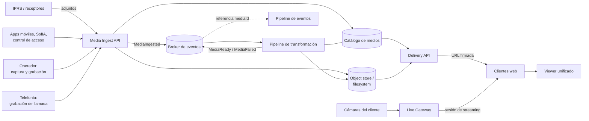

# Arquitectura de multimedia unificada

> Estado: propuesta de alto nivel para discusión.
>
> Alcance: reemplazar el manejo actual de imágenes, video y audio —hoy repartido
> entre stored procedures, triggers, rutas UNC, una cola ad-hoc y una decena de
> handlers— por un servicio único responsable de recibir, guardar, transformar,
> entregar y reproducir contenido multimedia.
>
> Se apoya en el relevamiento de [`multimedia-subsystem.md`](multimedia-subsystem.md)
> y es la contraparte, para multimedia, de
> [`arquitectura-eventos-tiempo-real.md`](../eventos/arquitectura-eventos-tiempo-real.md).

## 1. Problema

Hoy no existe "el subsistema multimedia". Existe multimedia repartida entre
capas que no se conocen entre sí.

**El catálogo está fragmentado en cinco tablas.** `p_RXImg` registra lo recibido;
`p_grabacion_mp4` y `p_grabacion_img` son subconjuntos denormalizados de la
anterior; `p_grabacion_audio` va por un camino propio que ni siquiera pasa por
`p_RXImg`; `p_grabacion_audio_aux` agrega metadatos en JSON. Un mismo archivo
puede estar descrito en dos tablas con convenciones distintas —`p_RXImg` a veces
concatena carpeta y nombre, `p_grabacion_mp4` los separa.

**El almacenamiento es una convención de directorios.** Las rutas se arman
concatenando parámetros de `t_parametros` con `{YYYYMM}\{LINEA_CUENTA}`. No hay
capa de abstracción: los SPs construyen paths UNC, los jobs ejecutan `xcopy`, y
el backend expone alias HTTP `/gallery/...` que mapean esos mismos directorios.

**El frontend arma las URLs a mano.** `ImagePanelController.js` y
`MultimediaGridView.js` concatenan `'/gallery/video/' + fecha + '/' + cuenta + '/' + archivo`.
El cliente conoce la estructura de carpetas del servidor.

**La transcodificación es una cola sin garantías.** `RemoteCallQueue` recibe
filas con `rcq_tipo='EXE'` y una línea de comando; un servicio Windows
(`TCPClientFFMpeg.exe`) las consume. Sin reintentos, sin dead letter, sin orden,
sin visibilidad de qué pasó si el servicio estaba caído.

**Cada formato tiene su visor.** `/handler/VideoTranscodeStream`,
`/handler/VideoTranscodeStreamWebm`, `/handler/dguardViewer`,
`/handler/vupointHandler`, `/handler/GenericSnapshotUrlPlayer`, IFrames directos,
y ramas por fabricante (HIK, Dahua, Risco, Alarm.com, Ajax). El frontend elige
por un `switch` sobre `rxi_cTipo` y sobre `t_VideoID`.

**Hay seis endpoints REST para leer lo mismo.** `SGSP_VideoLinkParser`,
`p_rximg`, `p_grabacion_audio`, `p_grabacion_img`, `Searchp_grabacion_mp4` y
`SGSP_SofiaVideoData`, cada uno con su forma de respuesta.

**La purga borra filas, no archivos.** Los triggers de borrado limpian `p_RXImg`
junto con el evento, pero nada elimina el archivo del disco. El almacenamiento
crece de forma monótona.

### 1.1 La confusión de fondo

`SGSP_VideoLinkParser` devuelve en una misma fila plana los archivos recibidos
(`p_RXImg`), la configuración de cámara en vivo (`t_VideoID`, `cuv_cLinkDSS`) y
los videos grabados (`p_grabacion_mp4`). El cliente desambigua por tipo.

Son **dos cosas distintas** tratadas como una:

| | Activo | Fuente en vivo |
|---|---|---|
| Qué es | Un archivo que existe | Un endpoint del que se puede tirar video |
| Identidad | Contenido inmutable | Configuración de una cámara |
| Ciclo de vida | Se crea, se sirve, se retiene, se purga | Se configura, se conecta, se corta |
| Falla típica | No está / se corrompió | La cámara no responde / NAT |
| Cómo se entrega | URL de descarga | Sesión de streaming |

Mientras esa distinción no exista en el modelo, cualquier unificación va a
arrastrar el `switch`.

## 2. Objetivos

### Funcionales

- Un solo lugar donde se recibe multimedia, venga de donde venga.
- Un solo catálogo que responda "qué archivos tiene este evento / esta cuenta".
- Entregar imagen, video y audio con la misma API, sin que el cliente conozca
  rutas de disco.
- Reproducir cualquier tipo soportado con un componente único.
- Ver una cámara en vivo sin abrir un visor distinto por fabricante.
- Conservar el vínculo entre un archivo y el evento que lo originó.
- Saber si un operador ya vio un adjunto, y para qué evento.

### Arquitectónicos

- El pipeline de eventos transporta **referencias**, nunca bytes.
- El almacenamiento es intercambiable: filesystem on-premise u object storage.
- Las transformaciones son trabajos con reintentos, cuarentena y trazabilidad.
- La retención es una política declarada, no un efecto de que nadie borra.
- Ejecutable en Linux y contenedores, igual en cloud que en servidor del cliente.

## 3. No objetivos iniciales

- No reescribir los visores propietarios de terceros (D-Guard, VuPoint) — se
  encapsulan, no se reimplementan.
- No migrar el archivo histórico existente como primer paso.
- No prometer streaming en vivo de todas las marcas desde el primer corte.
- No eliminar `p_RXImg` mientras haya lectores del esquema viejo.
- No convertir el servicio en un CMS de propósito general.

## 4. Principios

1. Un archivo se identifica por su **contenido**, no por su ruta.
2. El catálogo es la única fuente de verdad sobre qué existe y dónde.
3. Los bytes nunca viajan por el broker de eventos ni por la base de datos.
4. El cliente recibe **URLs**, no instrucciones para construirlas.
5. Activo y fuente en vivo son conceptos distintos con contratos distintos.
6. Toda transformación es reintentable e idempotente.
7. El estado de visualización es dato del dominio de atención, no del archivo.
8. La retención se declara por política y se ejecuta sobre metadato y bytes a la vez.
9. El servicio funciona igual con almacenamiento local que con almacenamiento objeto.
10. Un formato nuevo se agrega registrando un adaptador, no ramificando el cliente.

## 5. Arquitectura objetivo



### 5.1 Media Ingest API

Única puerta de entrada. Acepta dos modalidades:

- **Push**: el productor sube los bytes (multipart o presigned upload directo al
  store, con confirmación al servicio).
- **Pull**: el productor entrega una instrucción —"grabá 20 s de este RTSP",
  "traé este archivo de esta ruta"— y el servicio programa el trabajo.

La modalidad *pull* es la que absorbe lo que hoy hace `RemoteCallQueue`.

Responsabilidades: autenticar al productor, validar tipo y tamaño, calcular
hash, escribir en el store, registrar en el catálogo, publicar `MediaIngested`.
Devuelve un `mediaId` estable.

No resuelve reglas de negocio, no decide si genera alarma, no conoce la cuenta
más allá de guardarla como atributo.

### 5.2 Catálogo de medios

Reemplaza las cinco tablas actuales por un modelo único.

| Campo | Uso |
|---|---|
| `mediaId` | Identidad estable (ULID) |
| `tenantId`, `accountId` | Aislamiento y alcance |
| `kind` | `image` · `video` · `audio` |
| `origin` | `device` · `operator` · `recording` · `telephony` · `external` |
| `contentHash` | SHA-256 del contenido |
| `mimeType`, `sizeBytes`, `durationMs`, `width`, `height` | Metadatos técnicos |
| `storageKey`, `storageTier` | Dónde está, en qué nivel |
| `status` | `pending` · `processing` · `available` · `failed` · `purged` |
| `capturedAt`, `ingestedAt` | Cuándo ocurrió y cuándo llegó |
| `sourceRef` | Protocolo, parser, cámara o terminal de origen |
| `derivedFrom` | `mediaId` del original, si es una derivación |

Las relaciones con eventos van aparte, porque **un archivo puede pertenecer a
más de un evento** — es exactamente el caso de la duplicación VigiControl y del
mecanismo `_VA`, que hoy insertan filas nuevas apuntando al mismo archivo físico:

```
media_asset          1 ── N  media_event_link (mediaId, alarmId, role)
```

Esa separación resuelve por diseño algo que hoy se resuelve duplicando registros.

`p_grabacion_mp4` y `p_grabacion_img` desaparecen: eran proyecciones
denormalizadas de `p_RXImg` filtradas por tipo. En el modelo nuevo son consultas.

### 5.3 Almacenamiento

Interfaz mínima —`put`, `get`, `signUrl`, `delete`, `stat`— con dos
implementaciones desde el primer día:

- **Filesystem** para instalaciones on-premise, con layout content-addressed
  (`{prefijo-hash}/{hash}`) en vez de `{YYYYMM}/{cuenta}`.
- **Object storage** (S3 o compatible) para cloud.

El layout por contenido elimina la deduplicación manual: el mismo archivo
adjuntado a dos eventos se guarda una vez.

La organización por fecha y cuenta no se pierde: pasa a ser **índice en el
catálogo**, que es donde debía estar. Las consultas "todo lo de esta cuenta en
este mes" se responden por metadato, no recorriendo carpetas.

### 5.4 Pipeline de transformación

Reemplaza `RemoteCallQueue` + `TCPClientFFMpeg.exe`.

Trabajos previstos: grabación RTSP a formato web, conversión de AVI y otros
formatos legados, normalización de contenedores, generación de miniaturas y
poster frames, extracción de duración y dimensiones, y transcodificación
bajo demanda para formatos que el navegador no reproduce.

Cada trabajo declara entrada, salida esperada y política de reintento. Un
fallo permanente marca el activo como `failed` con causa, y eso es visible en
la UI en lugar de manifestarse como una imagen rota.

La diferencia operativa con hoy: si el worker está caído, los trabajos se
acumulan y se procesan al recuperarse. Hoy una fila en `RemoteCallQueue` con el
servicio caído no tiene quién la reclame.

### 5.5 Delivery API

Un solo contrato de lectura reemplaza los seis endpoints actuales:

```text
GET  /api/v1/media/{mediaId}                 → metadatos + URL firmada
GET  /api/v1/media?alarmId={id}              → activos de un evento
GET  /api/v1/media?accountId={id}&from=&to=  → historial por cuenta
POST /api/v1/media/{mediaId}/views           → registrar visualización
```

La respuesta trae **URLs absolutas y firmadas**, con vencimiento. El cliente
nunca concatena rutas.

Para video se sirven *range requests* para que el navegador pueda buscar sin
descargar el archivo completo — algo que hoy no ocurre con los IFrames a
`/gallery/...`.

La autorización se evalúa por activo: pertenencia de la cuenta al alcance del
usuario, igual criterio que el gateway de eventos.

### 5.6 Live Gateway

Atiende el otro concepto: ver una cámara **ahora**, no un archivo.

Encapsula por adaptador lo que hoy son ramas del frontend: RTSP genérico,
HikVision, Dahua, snapshot periódico, y los propietarios que exponen su propio
visor (D-Guard, VuPoint) que se integran como *embed* controlado en vez de
reimplementarse.

Expone una sesión de streaming con un contrato único, y el visor no necesita
saber la marca.

**Es la parte más difícil y conviene decirlo de entrada.** Las cámaras están en
la red del cliente, detrás de NAT. Servir su video a un operador que puede estar
en otra red es un problema de conectividad, no de formato. Las opciones
—relay en el borde, WebRTC con TURN, túnel saliente— tienen costos operativos
distintos y probablemente no haya una sola respuesta para todas las
instalaciones. Es el punto que más se beneficia de una prueba temprana.

### 5.7 Viewer unificado

Un componente embebible que recibe un `mediaId` o una sesión de streaming y
resuelve solo: elige reproductor por `kind` y `mimeType`, pide transcodificación
bajo demanda si el formato no es reproducible, muestra estado de carga y de
error, y reporta la visualización.

Reemplaza el `switch` por tipo y por fabricante que hoy vive en
`ImagePanelController.js`.

Agregar un formato nuevo pasa a ser registrar un adaptador en el servicio, sin
tocar el cliente.

## 6. Relación con el pipeline de eventos

Los dos sistemas se comunican por referencia, nunca por contenido.

| Momento | Mensaje | Emisor |
|---|---|---|
| Llegó un adjunto | `MediaIngested` (mediaId, alarmId, kind) | Media Service |
| Terminó la transformación | `MediaReady` (mediaId, variantes disponibles) | Media Service |
| Falló definitivamente | `MediaFailed` (mediaId, causa) | Media Service |
| Un operador lo vio | `MediaViewed` (mediaId, alarmId, operador) | Media Service |

El motor de dominio de alarmas consume estos hechos. La grilla de atención puede
mostrar "tiene adjunto, procesando" y actualizar a "listo" sin recargar, usando
el mismo canal en tiempo real que el resto de los cambios.

Esto también resuelve una asimetría actual: hoy el evento se crea y la
multimedia aparece después, sin que la pantalla se entere.

## 7. Estado de visualización y el caso `_VA`

Hoy `rxi_nEstado` hace dos trabajos incompatibles: para MP4 es estado de
**copia** (0 = falta copiar, y el trigger avanza a 1 tras encolar el `xcopy`),
y para JPG y AVI es estado de **visualización** (el propio trigger lo llama
"MultiMedia sin visualizar").

Sobre ese segundo significado hay una regla de negocio: al cerrar un evento con
adjunto no visto, `TG_UPD_ImgPendiente` genera una alarma `_VA` y vuelve a
colgar el mismo archivo del evento nuevo, para que alguien lo mire. El guard
`rec_calarma <> '_VA'` da exactamente una segunda oportunidad.

La propuesta separa las tres cosas:

| Concepto | Dónde vive |
|---|---|
| ¿El archivo está disponible? | `status` del activo, en el catálogo |
| ¿Quién lo vio y cuándo? | Registro de visualización, en el catálogo |
| ¿Cerrar sin ver debe generar otro evento? | **Regla del motor de dominio** |

La regla deja de ser un trigger sobre una tabla y pasa a ser una política
explícita: el motor recibe `AlarmResolved`, consulta si hay adjuntos sin
visualizar y decide. Se puede activar por cuenta, medir cuántos `_VA` genera y
apagar sin tocar un trigger.

> **Pendiente de verificar en base desplegada.** El SP `Searchp_rximg` puede
> marcar como visto cuando se lo invoca con `@nestado = 1`, pero no encontré
> ningún llamador en el código versionado. Si en la práctica nadie lo invoca,
> todo JPG que entre en estado 0 termina generando un `_VA`. Dos consultas lo
> resuelven: distribución de `rxi_nEstado` en `p_RXImg`, y peso de `_VA` sobre
> el total de eventos. La respuesta cambia el dimensionamiento de la migración,
> no el diseño.

## 8. Ciclo de vida y retención

Hoy el borrado de un evento limpia `p_RXImg` pero deja el archivo en disco. El
resultado es almacenamiento que sólo crece y un catálogo que ya no sabe que ese
archivo existe.

La propuesta hace explícito el ciclo:

```text
ingested → processing → available → (archived) → purged
```

Con política declarada por tenant y por tipo: cuánto se conserva video, cuánto
imagen, cuánto audio de llamada; qué se mueve a almacenamiento frío y cuándo; y
qué se hace con material asociado a un evento bajo investigación, que
típicamente no debe purgarse por antigüedad.

La purga es una operación del servicio que borra **bytes y metadato juntos**, y
deja registro de que existió.

El audio de llamadas tiene además implicancias regulatorias que conviene tratar
como política, no como consecuencia de qué job corrió.

## 9. Despliegue

El servicio debe correr en las dos topologías sin dos bases de código.

| | On-premise | Cloud |
|---|---|---|
| Almacenamiento | Filesystem local o NAS | Object storage |
| Entrega | URLs firmadas por el servicio | URLs firmadas o CDN |
| Transformación | Worker en el mismo host | Workers escalables |
| Live | Gateway local junto a las cámaras | Gateway con relay en el borde |

La diferencia queda contenida en la implementación del puerto de
almacenamiento y en la topología del Live Gateway. La API que ve el cliente es
la misma.

## 10. Migración

Multimedia tiene una ventaja sobre eventos: **es mayormente lectura**, y el
contenido viejo puede seguir donde está mientras el catálogo aprende a
encontrarlo.

**Fase 1 — Catálogo por encima de lo existente.** El servicio indexa lo que ya
hay en `p_RXImg` y en disco, sin mover un archivo. Expone la Delivery API
resolviendo contra las rutas actuales. Nada cambia para quien escribe.

**Fase 2 — Un solo lector.** El frontend deja de armar URLs y de usar los seis
endpoints; pasa a consumir la Delivery API. El viewer unificado reemplaza el
`switch`. Sigue sin cambiar nada del lado de la escritura.

**Fase 3 — Ingesta nueva.** Los productores empiezan a subir por la Ingest API.
El servicio escribe en el store nuevo y, durante la transición, también registra
en `p_RXImg` para que los lectores no migrados sigan funcionando.

**Fase 4 — Transformaciones.** Los trabajos de `RemoteCallQueue` se mueven al
pipeline nuevo, uno por tipo, empezando por el de mayor volumen.

**Fase 5 — Live.** El gateway toma los fabricantes de a uno, con vuelta atrás al
handler actual.

**Fase 6 — Retención y retiro.** Se activa la política de ciclo de vida, se
migra el histórico que valga la pena y se retiran las tablas viejas cuando no
queden lectores.

El orden no es caprichoso: las primeras dos fases entregan valor —un solo
contrato de lectura y un visor único— sin tocar el camino de escritura, que es
el más riesgoso.

## 11. Riesgos

**El volumen es desconocido.** No sabemos cuántos archivos hay, cuánto pesan ni
a qué ritmo crecen. Es el primer dato a medir: define si el almacenamiento
objeto conviene, cuánto cuesta y si la migración del histórico es viable.

**Live streaming es un problema de red, no de video.** Cámaras detrás de NAT en
la red del cliente. Es lo más probable que obligue a un componente en el borde.

**Formatos propietarios.** `CWU`, `VUP`, `DNL` y los visores de terceros no se
resuelven con ffmpeg. Necesitan encapsulación y, en algunos casos, seguir
dependiendo del visor del fabricante.

**Doble escritura durante la transición.** Escribir en el catálogo nuevo y en
`p_RXImg` a la vez tiene el mismo problema que ya identificamos en eventos, y
se mitiga igual: outbox, no dos escrituras independientes.

**Contenido sensible.** Video e imágenes de personas tienen requisitos de
retención, acceso y borrado que hoy no están declarados en ningún lado.

**El histórico puede no valer la pena.** Migrar años de video a object storage
puede costar más que su valor. Es una decisión de negocio, y la arquitectura
debe permitir dejarlo donde está y seguir sirviéndolo.

## 12. Decisiones que requieren datos

1. Volumen total, tamaño medio por tipo y tasa de crecimiento.
2. Retención requerida por tipo, y si hay obligación legal sobre audio de llamadas.
3. Qué proporción del tráfico es en vivo versus grabado.
4. Marcas y modelos de cámara efectivamente en uso, y cuáles justifican adaptador propio.
5. Topología de red típica: ¿el operador está en la misma red que las cámaras?
6. Si `Searchp_rximg` con `@nestado = 1` se invoca en producción (§7).
7. Cuántos `_VA` se generan hoy, y si la regla sigue teniendo sentido de negocio.
8. Si hay instalaciones sin acceso a internet que deban seguir operando multimedia.
9. Costo aceptable de almacenamiento por cuenta y por mes.
10. Si el histórico se migra, se deja en su lugar o se descarta por antigüedad.

## 13. Qué habilita esto

Más allá de ordenar lo que ya existe, un servicio de medios único abre cosas que
hoy no son abordables:

- Buscar multimedia por cuenta, fecha y tipo sin recorrer carpetas.
- Adjuntar evidencia a un informe sin copiar archivos.
- Servir video a un móvil sin descargar el archivo entero.
- Agregar un fabricante de cámara sin tocar el cliente.
- Aplicar retención y borrado con garantías demostrables.
- Analizar contenido —detección, clasificación— sobre un flujo de ingreso único
  en lugar de sobre siete caminos distintos.

Ninguna de esas cosas requiere decidirse ahora. Todas dependen de que exista un
único lugar por donde la multimedia entra y sale.
